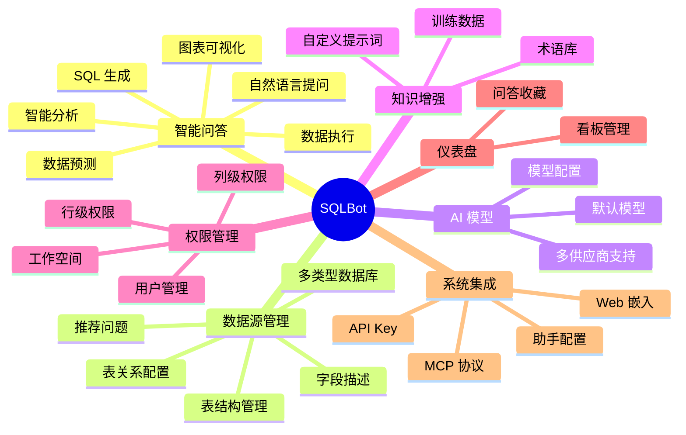

# 1.2 功能需求规格

## 1. 功能模块总览

---

## 2. 核心功能详细需求

### 2.1 智能问答

#### 2.1.1 自然语言提问

| 需求项 | 描述 |
| :--- | :--- |
| 用户故事 | 作为业务用户，我希望用自然语言提问，获取数据结果 |
| 输入 | 自然语言问题（如"上个月销售额是多少"） |
| 输出 | SQL、执行结果、可视化图表 |
| 验收标准 | 问题能正确转换为 SQL 并返回数据 |

#### 2.1.2 流式响应

| 需求项 | 描述 |
| :--- | :--- |
| 用户故事 | 作为用户，我希望看到 AI 的实时思考过程 |
| 技术方案 | SSE (Server-Sent Events) |
| 阶段划分 | 数据源选择 → SQL 生成 → SQL 执行 → 图表生成 |

#### 2.1.3 图表类型支持

| 图表类型 | 说明 |
| :--- | :--- |
| 表格 (table) | 数据表格展示 |
| 柱状图 (bar) | 分类对比 |
| 折线图 (line) | 趋势分析 |
| 饼图 (pie) | 占比分析 |
| 面积图 (area) | 趋势堆叠 |
| 散点图 (scatter) | 相关性分析 |

#### 2.1.4 历史记录

| 需求项 | 描述 |
| :--- | :--- |
| 历史列表 | 显示所有对话历史 |
| 对话续接 | 支持在历史对话基础上继续提问 |
| 重新生成 | 对不满意的回答重新生成 |
| 删除对话 | 删除单条或批量删除 |

---

### 2.2 数据源管理

#### 2.2.1 数据库类型支持

| 数据库 | 状态 |
| :--- | :--- |
| PostgreSQL | ✅ 支持 |
| MySQL | ✅ 支持 |
| Oracle | ✅ 支持 |
| SQL Server | ✅ 支持 |
| ClickHouse | ✅ 支持 |
| DM (达梦) | ✅ 支持 |
| Redshift | ✅ 支持 |
| Elasticsearch | ✅ 支持 |
| Excel 文件 | ✅ 支持 |

#### 2.2.2 连接配置

| 字段 | 说明 | 必填 |
| :--- | :--- | :---: |
| 数据源名称 | 显示名称 | ✅ |
| 数据库类型 | 选择数据库类型 | ✅ |
| 主机地址 | 数据库服务器 IP/域名 | ✅ |
| 端口 | 数据库端口 | ✅ |
| 数据库名 | 目标数据库 | ✅ |
| 用户名 | 认证用户 | ✅ |
| 密码 | 认证密码 | ✅ |
| Schema | 模式（可选） | ❌ |

#### 2.2.3 表结构管理

| 功能 | 描述 |
| :--- | :--- |
| 自动同步 | 从数据库同步表结构 |
| 表描述 | 为表添加业务含义描述 |
| 字段描述 | 为字段添加业务含义描述 |
| 字段排序 | 调整字段显示顺序 |
| 隐藏字段 | 隐藏不常用字段 |

#### 2.2.4 表关系配置

| 功能 | 描述 |
| :--- | :--- |
| 主外键关系 | 定义表之间的关联关系 |
| 关系类型 | 一对一、一对多、多对多 |
| 关联字段 | 指定关联的字段 |

---

### 2.3 知识增强

#### 2.3.1 术语库

| 功能 | 描述 |
| :--- | :--- |
| 术语定义 | 定义业务术语与数据库字段的映射 |
| 同义词 | 支持一个术语的多种表达方式 |
| 数据源关联 | 术语可关联到特定数据源 |
| 向量检索 | 基于语义相似度匹配术语 |

#### 2.3.2 训练数据

| 功能 | 描述 |
| :--- | :--- |
| SQL 示例 | 记录问题与 SQL 的对应关系 |
| 向量检索 | 基于语义相似度匹配历史 SQL |
| 数据源关联 | 示例可关联到特定数据源 |

#### 2.3.3 自定义提示词

| 功能 | 描述 |
| :--- | :--- |
| 系统提示词 | 自定义 SQL 生成的系统提示词 |
| 数据源级别 | 可针对特定数据源定制 |

---

### 2.4 权限管理

#### 2.4.1 用户管理

| 角色 | 权限 |
| :--- | :--- |
| 管理员 | 全部权限 |
| 普通用户 | 问答、查看数据源、查看仪表盘 |

#### 2.4.2 工作空间

| 功能 | 描述 |
| :--- | :--- |
| 空间隔离 | 不同工作空间的数据完全隔离 |
| 用户分配 | 用户可属于多个工作空间 |
| 资源归属 | 数据源、术语、仪表盘归属于工作空间 |

#### 2.4.3 数据权限

| 类型 | 描述 |
| :--- | :--- |
| 行级权限 | 限制用户只能访问特定行数据 |
| 列级权限 | 限制用户只能访问特定列 |
| 表级权限 | 限制用户可访问的表范围 |

---

### 2.5 仪表盘

| 功能 | 描述 |
| :--- | :--- |
| 收藏问答 | 将问答结果保存到仪表盘 |
| 看板管理 | 创建、编辑、删除看板 |
| 布局调整 | 拖拽调整图表位置和大小 |
| 分享 | 分享看板给其他用户 |

---

### 2.6 系统集成

#### 2.6.1 Web 嵌入

| 嵌入方式 | 描述 |
| :--- | :--- |
| iframe 嵌入 | 完整页面嵌入到其他系统 |
| 弹窗嵌入 | 浮动弹窗形式嵌入 |
| 组件嵌入 | 仅嵌入问答组件 |

#### 2.6.2 助手配置

| 功能 | 描述 |
| :--- | :--- |
| 创建助手 | 配置嵌入式助手 |
| 域名白名单 | 限制可嵌入的域名 |
| 样式定制 | 自定义嵌入页面样式 |
| Token 认证 | 嵌入访问的认证方式 |

#### 2.6.3 MCP 协议

| 功能 | 描述 |
| :--- | :--- |
| MCP Server | 符合 Model Context Protocol 的服务端 |
| 工具暴露 | 数据源列表、模型列表、问答接口 |
| 集成场景 | Claude、n8n、Dify 等支持 MCP 的应用 |

#### 2.6.4 API Key

| 功能 | 描述 |
| :--- | :--- |
| 密钥生成 | 生成 API 访问密钥 |
| 密钥管理 | 查看、启用、禁用、删除密钥 |
| 权限继承 | API 调用继承对应用户的权限 |

---

## 3. 非功能性需求

### 3.1 性能需求

| 指标 | 目标值 |
| :--- | :--- |
| 首次响应时间 | < 2 秒 |
| SQL 生成时间 | < 10 秒（取决于模型） |
| 并发用户数 | 100+ |
| API 响应时间 | P95 < 500ms |

### 3.2 安全需求

| 安全项 | 实现方式 |
| :--- | :--- |
| 认证 | JWT Token |
| 密码存储 | bcrypt 加密 |
| 敏感数据 | AES 加密 |
| SQL 注入防护 | ORM + 参数化查询 |
| XSS 防护 | 输入过滤 + CSP |

### 3.3 可用性需求

| 需求项 | 描述 |
| :--- | :--- |
| 部署方式 | Docker 一键部署 |
| 数据备份 | 支持数据库导出 |
| 日志记录 | 操作日志、错误日志 |
| 监控检查 | 健康检查端点 |

### 3.4 兼容性需求

| 类型 | 支持范围 |
| :--- | :--- |
| 浏览器 | Chrome 90+, Firefox 90+, Safari 14+, Edge 90+ |
| 分辨率 | 最小 1280x720 |
| 移动端 | 基础支持（非主要场景） |
