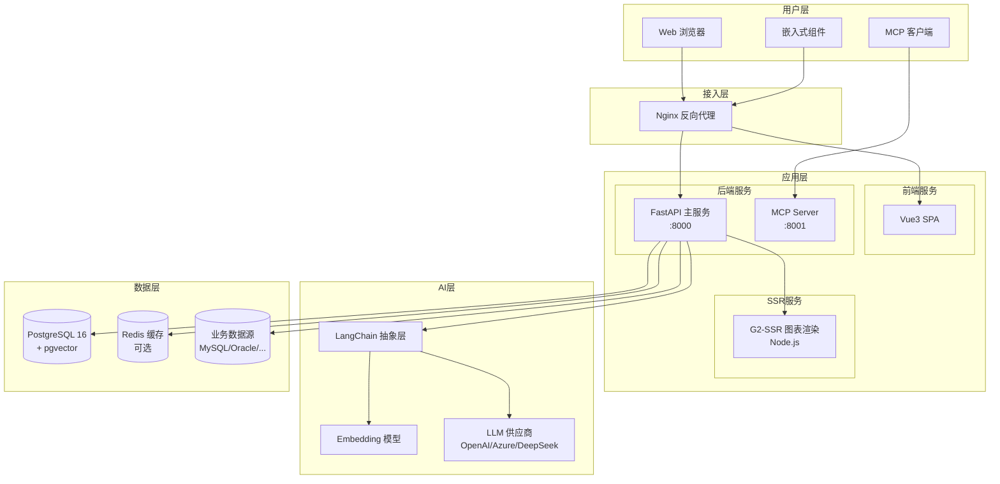
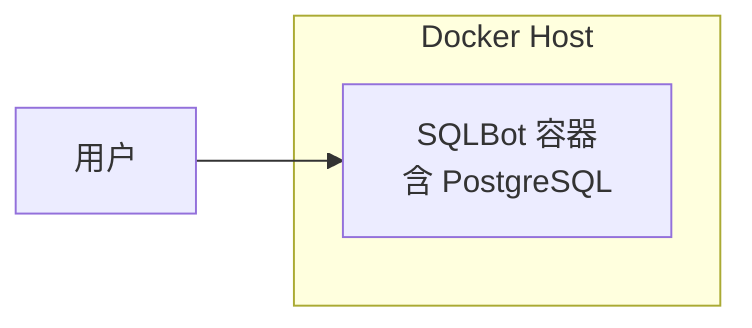
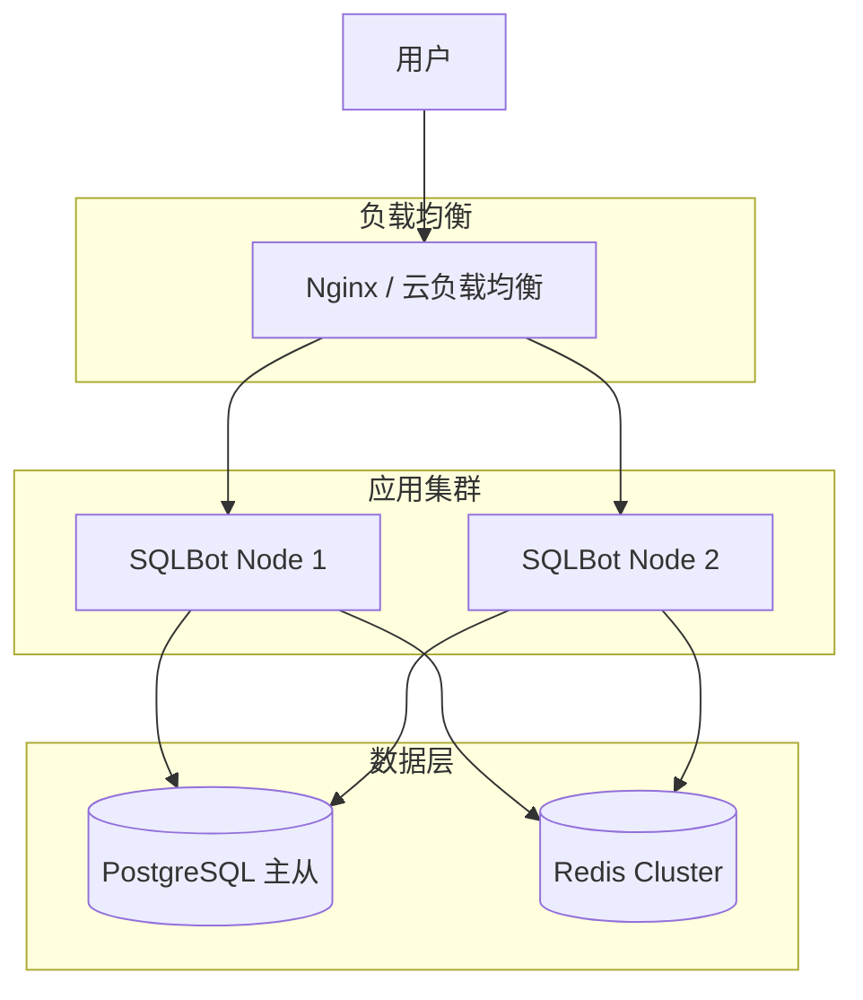
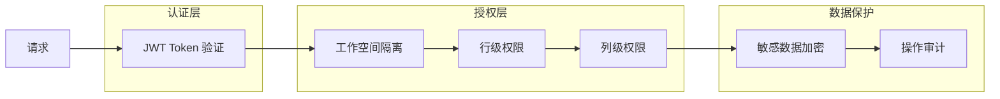

# 2.1 系统架构总览

## 1. 整体架构图

---

## 2. 服务拓扑

| 服务名称 | 端口 | 技术栈 | 职责 |
| :--- | :---: | :--- | :--- |
| **Frontend** | 5173 (dev) | Vue 3 + Vite | 用户界面、交互逻辑 |
| **Backend API** | 8000 | FastAPI + Python 3.11 | 核心业务逻辑、API 接口 |
| **MCP Server** | 8001 | FastAPI-MCP | Model Context Protocol 服务 |
| **G2-SSR** | 3000 | Node.js + Express | 服务端图表渲染 |
| **PostgreSQL** | 5432 | PostgreSQL 16 + pgvector | 元数据存储、向量检索 |
| **Redis** | 6379 | Redis | 缓存（可选） |

---

## 3. 技术栈详解

### 3.1 前端技术栈

| 类别 | 技术 | 用途 |
| :--- | :--- | :--- |
| 框架 | Vue 3 + TypeScript | 响应式 UI 开发 |
| 构建工具 | Vite | 快速开发与构建 |
| UI 组件库 | Element Plus | 基础 UI 组件 |
| 状态管理 | Pinia | 全局状态管理 |
| 路由 | Vue Router | 单页应用路由 |
| 可视化 | AntV G2 / S2 | 图表与透视表 |
| 国际化 | vue-i18n | 多语言支持 |
| HTTP 客户端 | Axios | API 请求 |

### 3.2 后端技术栈

| 类别 | 技术 | 用途 |
| :--- | :--- | :--- |
| 框架 | FastAPI | 高性能异步 Web 框架 |
| ORM | SQLModel + SQLAlchemy | 数据库操作 |
| 迁移工具 | Alembic | 数据库版本管理 |
| 包管理 | uv | 依赖管理与虚拟环境 |
| 认证 | JWT (PyJWT) | 无状态身份认证 |
| 加密 | PyCryptodome | 敏感数据加密 |
| 日志 | Python logging | 统一日志管理 |

### 3.3 AI/LLM 技术栈

| 类别 | 技术 | 用途 |
| :--- | :--- | :--- |
| 抽象层 | LangChain | LLM 调用统一接口 |
| 模型接入 | langchain-openai | OpenAI/Azure 接入 |
| 嵌入模型 | langchain-huggingface | 本地 Embedding |
| 向量存储 | pgvector | PostgreSQL 向量检索 |
| 默认模型 | text2vec-base-chinese | 中文语义嵌入 |

### 3.4 数据库设计

| 数据库 | 用途 |
| :--- | :--- |
| **PostgreSQL** | 系统元数据、用户数据、聊天记录、AI 配置 |
| **pgvector 扩展** | 术语嵌入向量、训练数据向量、表结构向量 |
| **业务数据源** | 用户连接的外部数据库（MySQL、Oracle、SQL Server 等） |

---

## 4. 部署架构

### 4.1 单机部署（开发/测试）

### 4.2 生产部署（推荐）

---

## 5. 通信协议

| 场景 | 协议 | 说明 |
| :--- | :--- | :--- |
| 前后端通信 | HTTP/HTTPS + JSON | RESTful API |
| 实时消息 | SSE (Server-Sent Events) | 流式 AI 响应 |
| MCP 调用 | HTTP + JSON | Model Context Protocol |
| 数据库连接 | 各数据库原生协议 | PostgreSQL、MySQL、Oracle 等 |

---

## 6. 安全架构

---

## 7. 扩展点

| 扩展点 | 说明 |
| :--- | :--- |
| **LLM 供应商** | 通过 `LLMFactory` 注册新的模型驱动 |
| **数据源类型** | 在 `datasource` 模块添加新的连接器 |
| **图表类型** | 扩展 G2-SSR 的图表配置 |
| **认证方式** | 支持 LDAP、OAuth2（企业版） |
| **嵌入方式** | 通过 Assistant 配置自定义嵌入页面 |
