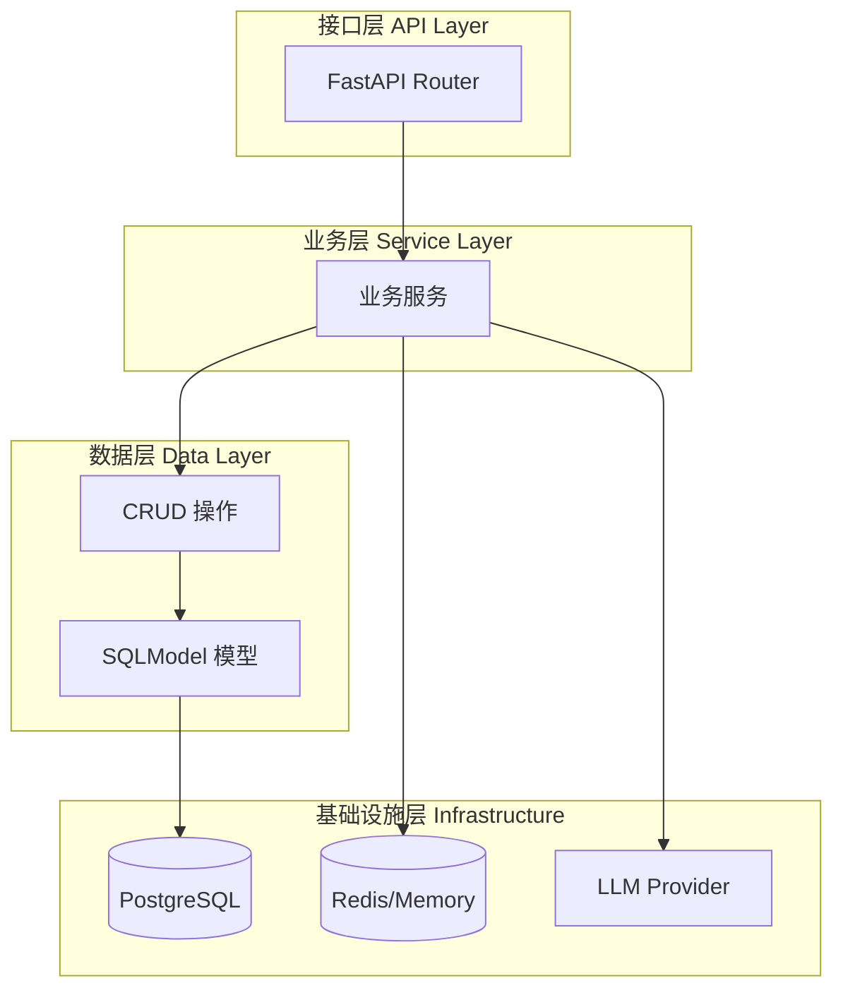
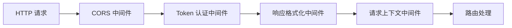

# 2.2 后端架构设计

## 1. 整体结构

后端采用 **FastAPI** 框架，遵循分层架构设计：

```
backend/
├── main.py                 # 应用入口
├── apps/                   # 业务模块
│   ├── api.py              # 路由注册中心
│   ├── ai_model/           # AI 模型管理
│   ├── chat/               # 智能问答核心
│   ├── dashboard/          # 仪表盘
│   ├── data_training/      # 训练数据管理
│   ├── datasource/         # 数据源管理
│   ├── db/                 # 数据库工具
│   ├── mcp/                # MCP 协议
│   ├── settings/           # 系统设置
│   ├── swagger/            # API 文档
│   ├── system/             # 系统管理（用户、工作空间、助手）
│   ├── template/           # 提示词模板
│   └── terminology/        # 术语库
├── common/                 # 公共模块
│   ├── core/               # 核心配置与工具
│   ├── audit/              # 审计日志
│   ├── error.py            # 异常定义
│   └── utils/              # 通用工具函数
├── alembic/                # 数据库迁移
├── locales/                # 国际化资源
├── templates/              # Prompt 模板文件
└── models/                 # 本地 AI 模型文件
```

---

## 2. 分层架构



### 2.1 各层职责

| 层级 | 目录 | 职责 |
| :--- | :--- | :--- |
| **API 层** | `apps/*/api/` | 路由定义、请求验证、响应格式化 |
| **Service 层** | `apps/*/crud/` 或 `apps/*/task/` | 业务逻辑、事务管理 |
| **Model 层** | `apps/*/models/` | 数据模型定义 |
| **Schema 层** | `apps/*/schemas/` | 请求/响应数据结构 |

---

## 3. 核心模块详解

### 3.1 Chat 模块 (智能问答)

```
apps/chat/
├── api/
│   └── chat.py             # 问答相关 API
├── curd/
│   └── chat.py             # 聊天记录 CRUD
├── models/
│   └── chat_model.py       # Chat、ChatRecord 模型
├── schemas/
│   └── chat_schema.py      # 请求/响应 Schema
└── task/
    └── llm.py              # LLMService 核心逻辑
```

**核心类：`LLMService`**
- 职责：编排整个问答流程
- 关键方法：
  - `run_task()` - 主流程入口
  - `generate_sql()` - SQL 生成
  - `execute_sql()` - SQL 执行
  - `generate_chart()` - 图表配置生成

### 3.2 Datasource 模块 (数据源管理)

```
apps/datasource/
├── api/
│   ├── datasource.py       # 数据源 CRUD API
│   ├── table_relation.py   # 表关系管理
│   └── recommended_problem.py # 推荐问题
├── curd/
│   ├── datasource.py       # 数据源操作
│   └── table.py            # 表元数据管理
├── db/
│   ├── pg.py               # PostgreSQL 连接器
│   ├── mysql.py            # MySQL 连接器
│   ├── oracle.py           # Oracle 连接器
│   └── ...                 # 其他数据库
├── embedding/              # 表结构向量化
└── models/
    └── datasource_model.py # CoreDatasource 模型
```

### 3.3 System 模块 (系统管理)

```
apps/system/
├── api/
│   ├── login.py            # 登录认证
│   ├── user.py             # 用户管理
│   ├── workspace.py        # 工作空间
│   ├── assistant.py        # 助手管理
│   ├── aimodel.py          # AI 模型配置
│   └── apikey.py           # API Key 管理
├── crud/                   # 对应 CRUD 操作
├── models/                 # 数据模型
├── schemas/                # Schema 定义
└── middleware/
    └── auth.py             # Token 认证中间件
```

### 3.4 AI Model 模块

```
apps/ai_model/
├── model_factory.py        # LLM 工厂类
├── embedding.py            # Embedding 模型管理
└── openai/
    └── llm.py              # 自定义 ChatOpenAI 实现
```

---

## 4. 中间件链



### 4.1 中间件说明

| 中间件 | 类名 | 职责 |
| :--- | :--- | :--- |
| CORS | `CORSMiddleware` | 跨域请求处理 |
| Token 认证 | `TokenMiddleware` | JWT Token 验证 |
| 响应格式化 | `ResponseMiddleware` | 统一响应结构 |
| 请求上下文 | `RequestContextMiddleware` | 注入当前用户、工作空间信息 |

---

## 5. 应用生命周期

```python
@asynccontextmanager
async def lifespan(app: FastAPI):
    # 1. 执行数据库迁移
    run_migrations()
    
    # 2. 初始化缓存
    init_sqlbot_cache()
    
    # 3. 初始化动态 CORS
    init_dynamic_cors(app)
    
    # 4. 填充 Embedding 数据
    init_terminology_embedding_data()
    init_data_training_embedding_data()
    init_table_and_ds_embedding()
    
    # 5. 加密已有模型密钥
    await async_model_info()
    
    SQLBotLogUtil.info("✅ SQLBot 初始化完成")
    yield
    SQLBotLogUtil.info("SQLBot 应用关闭")
```

---

## 6. 异常处理

```python
# 全局异常处理器
app.add_exception_handler(StarletteHTTPException, http_exception_handler)
app.add_exception_handler(Exception, global_exception_handler)
```

### 6.1 自定义异常

| 异常类 | 用途 |
| :--- | :--- |
| `SingleMessageError` | 直接返回给前端的提示信息 |
| `SQLBotDBError` | 数据库执行错误 |
| `SQLBotDBConnectionError` | 数据库连接失败 |
| `ParseSQLResultError` | SQL 结果解析错误 |

---

## 7. 配置管理

配置通过 `pydantic-settings` 管理，支持环境变量覆盖：

```python
# common/core/config.py
class Settings(BaseSettings):
    model_config = SettingsConfigDict(
        env_file="../.env",
        env_ignore_empty=True,
        extra="ignore",
    )
    
    # 数据库配置
    POSTGRES_SERVER: str = 'localhost'
    POSTGRES_PORT: int = 5432
    POSTGRES_DB: str = "sqlbot"
    
    # AI 配置
    DEFAULT_EMBEDDING_MODEL: str = 'shibing624/text2vec-base-chinese'
    EMBEDDING_ENABLED: bool = True
    
    # 缓存配置
    CACHE_TYPE: Literal["redis", "memory", "None"] = "memory"
```

### 7.1 关键配置项

| 配置项 | 默认值 | 说明 |
| :--- | :--- | :--- |
| `SQLBOT_DB_URL` | - | 完整数据库连接串 |
| `ACCESS_TOKEN_EXPIRE_MINUTES` | 11520 (8天) | Token 有效期 |
| `EMBEDDING_ENABLED` | true | 是否启用向量检索 |
| `TABLE_EMBEDDING_COUNT` | 10 | 检索的相关表数量 |
| `CACHE_TYPE` | memory | 缓存类型 |

---

## 8. 日志规范

```python
# 使用统一的日志工具
from common.utils.utils import SQLBotLogUtil

SQLBotLogUtil.info("操作成功")
SQLBotLogUtil.error("操作失败")
SQLBotLogUtil.exception("异常详情")
```

日志配置：
- 日志目录：`logs/`
- 日志级别：通过 `LOG_LEVEL` 环境变量控制
- 日志格式：`%(asctime)s - %(name)s - %(levelname)s:%(lineno)d - %(message)s`
