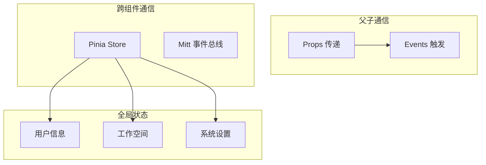

# 2.3 前端架构设计

## 1. 项目结构

前端采用 **Vue 3 + TypeScript + Vite** 技术栈：

```
frontend/
├── index.html              # 入口 HTML
├── vite.config.ts          # Vite 配置
├── tsconfig.json           # TypeScript 配置
├── package.json            # 依赖管理
├── pnpm-lock.yaml          # 锁定文件
├── .env.development        # 开发环境变量
├── .env.production         # 生产环境变量
├── public/                 # 静态资源
│   ├── swagger-ui.css      # Swagger 样式
│   └── swagger-ui-bundle.js
└── src/
    ├── main.ts             # 应用入口
    ├── App.vue             # 根组件
    ├── api/                # API 请求模块
    ├── assets/             # 静态资源（图片、样式）
    ├── components/         # 公共组件
    ├── entity/             # 类型定义
    ├── i18n/               # 国际化
    ├── router/             # 路由配置
    ├── stores/             # Pinia 状态管理
    ├── utils/              # 工具函数
    └── views/              # 页面视图
```

---

## 2. 模块划分

### 2.1 视图模块 (views/)

| 目录 | 功能 | 主要页面 |
| :--- | :--- | :--- |
| `chat/` | 智能问答 | 对话界面、历史记录 |
| `dashboard/` | 仪表盘 | 看板管理、图表展示 |
| `ds/` | 数据源 | 数据源列表、表管理、权限配置 |
| `embedded/` | 嵌入模式 | iframe 嵌入页面 |
| `login/` | 登录 | 登录页、密码修改 |
| `system/` | 系统管理 | 用户、工作空间、AI 模型、助手 |
| `work/` | 工作空间 | 空间切换 |
| `error/` | 错误页 | 404 等错误页面 |

### 2.2 API 模块 (api/)

| 文件 | 对应后端模块 | 主要接口 |
| :--- | :--- | :--- |
| `chat.ts` | Chat 模块 | 问答、历史记录 |
| `datasource.ts` | Datasource 模块 | 数据源 CRUD |
| `dashboard.ts` | Dashboard 模块 | 仪表盘管理 |
| `auth.ts` | System/Login | 认证相关 |
| `user.ts` | System/User | 用户管理 |
| `workspace.ts` | System/Workspace | 工作空间 |
| `assistant.ts` | System/Assistant | 助手配置 |
| `system.ts` | System/AIModel | AI 模型配置 |
| `training.ts` | Data Training | 训练数据 |
| `setting.ts` | Settings | 系统设置 |

### 2.3 状态管理 (stores/)

```
stores/
├── index.ts                # Store 入口
├── user.ts                 # 用户状态
├── chat.ts                 # 聊天状态
├── workspace.ts            # 工作空间状态
├── setting.ts              # 系统设置
├── embedded.ts             # 嵌入模式状态
└── ...
```

---

## 3. 技术选型

| 类别 | 技术 | 版本 | 用途 |
| :--- | :--- | :---: | :--- |
| **框架** | Vue | 3.5+ | 响应式 UI |
| **语言** | TypeScript | 5.7+ | 类型安全 |
| **构建** | Vite | 6.3+ | 开发与构建 |
| **UI 库** | Element Plus | 2.10+ | 基础组件 |
| **状态管理** | Pinia | 3.0+ | 全局状态 |
| **路由** | Vue Router | 4.5+ | SPA 路由 |
| **HTTP** | Axios | 1.8+ | API 请求 |
| **图表** | AntV G2 | 5.3+ | 数据可视化 |
| **透视表** | AntV S2 | 2.4+ | 多维分析 |
| **国际化** | vue-i18n | 9.14+ | 多语言 |
| **日期** | dayjs | 1.11+ | 日期处理 |
| **Markdown** | markdown-it | 14.1+ | 渲染 Markdown |
| **代码高亮** | highlight.js | 11.11+ | 语法高亮 |

---

## 4. 路由设计

```typescript
// router/index.ts
const routes = [
  { path: '/login', component: LoginView },
  { path: '/work', component: WorkLayout, children: [
    { path: '/chat', component: ChatView },
    { path: '/dashboard', component: DashboardView },
    { path: '/ds', component: DatasourceView },
    { path: '/system', component: SystemView, children: [
      { path: 'user', component: UserManage },
      { path: 'workspace', component: WorkspaceManage },
      { path: 'aimodel', component: AIModelManage },
      { path: 'assistant', component: AssistantManage },
      // ...
    ]}
  ]},
  { path: '/embedded/:token', component: EmbeddedView },
  { path: '/:pathMatch(.*)*', component: NotFound }
]
```

### 4.1 路由守卫

```typescript
router.beforeEach((to, from, next) => {
  // 1. 检查 Token 是否存在
  const token = getToken()
  
  // 2. 白名单页面直接放行
  if (whiteList.includes(to.path)) {
    return next()
  }
  
  // 3. 未登录跳转登录页
  if (!token) {
    return next('/login')
  }
  
  // 4. 已登录正常放行
  next()
})
```

---

## 5. 组件设计

### 5.1 公共组件 (components/)

| 组件 | 用途 |
| :--- | :--- |
| `ChatMessage.vue` | 聊天消息气泡 |
| `ChartRenderer.vue` | 图表渲染器 |
| `DataTable.vue` | 数据表格 |
| `SqlEditor.vue` | SQL 编辑器 |
| `MarkdownViewer.vue` | Markdown 渲染 |
| `IconPicker.vue` | 图标选择器 |
| `ConfirmDialog.vue` | 确认对话框 |

### 5.2 组件通信



---

## 6. API 请求封装

```typescript
// utils/request.ts
import axios from 'axios'

const service = axios.create({
  baseURL: import.meta.env.VITE_API_BASE_URL,
  timeout: 30000
})

// 请求拦截器
service.interceptors.request.use(config => {
  const token = getToken()
  if (token) {
    config.headers['X-SQLBOT-TOKEN'] = token
  }
  return config
})

// 响应拦截器
service.interceptors.response.use(
  response => response.data,
  error => {
    if (error.response?.status === 401) {
      // Token 过期，跳转登录
      router.push('/login')
    }
    return Promise.reject(error)
  }
)
```

---

## 7. SSE 流式处理

```typescript
// 智能问答使用 SSE 接收流式响应
const eventSource = new EventSource(`${API_BASE}/chat/question?${params}`)

eventSource.onmessage = (event) => {
  const data = JSON.parse(event.data)
  
  switch (data.type) {
    case 'sql-result':
      // 更新 SQL 生成进度
      break
    case 'sql':
      // 显示最终 SQL
      break
    case 'sql-data':
      // 显示查询结果
      break
    case 'chart':
      // 渲染图表
      break
    case 'error':
      // 显示错误
      break
    case 'finish':
      eventSource.close()
      break
  }
}
```

---

## 8. 样式管理

| 文件 | 用途 |
| :--- | :--- |
| `src/style.less` | 全局样式 |
| `src/assets/` | 静态资源 |
| 组件内 `<style scoped>` | 组件私有样式 |

### 8.1 主题变量

```less
// 主色调
@primary-color: #409EFF;
@success-color: #67C23A;
@warning-color: #E6A23C;
@danger-color: #F56C6C;

// 背景色
@bg-color: #f5f7fa;
@card-bg-color: #ffffff;

// 文字颜色
@text-primary: #303133;
@text-regular: #606266;
@text-secondary: #909399;
```

---

## 9. 国际化

```
src/i18n/
├── index.ts                # i18n 配置
├── zh-CN.json              # 中文
├── en-US.json              # 英文
└── ...
```

### 9.1 使用方式

```vue
<template>
  <span>{{ $t('chat.newConversation') }}</span>
</template>

<script setup>
import { useI18n } from 'vue-i18n'
const { t } = useI18n()
console.log(t('common.confirm'))
</script>
```

---

## 10. 环境配置

```bash
# .env.development
VITE_API_BASE_URL=http://localhost:8000/api/v1
VITE_APP_TITLE=SQLBot (Development)

# .env.production
VITE_API_BASE_URL=/api/v1
VITE_APP_TITLE=SQLBot
```

---

## 11. 构建与部署

```bash
# 开发模式
pnpm dev

# 生产构建
pnpm build

# 预览构建结果
pnpm preview
```

构建产物位于 `dist/` 目录，可直接部署到 Nginx 或 CDN。
