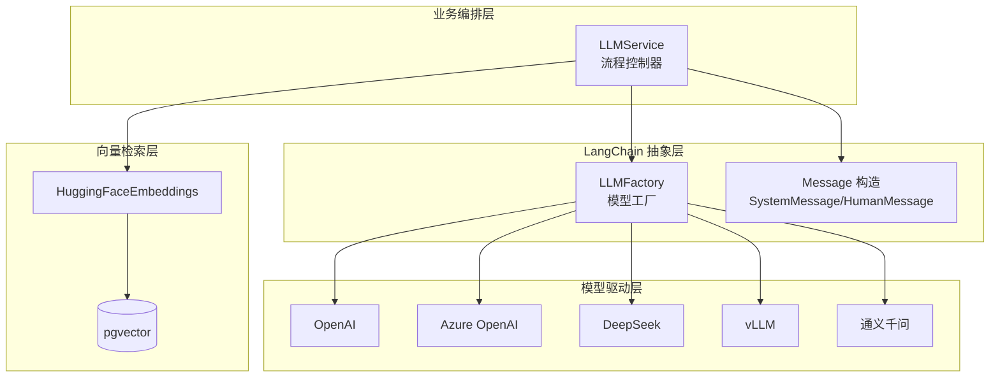
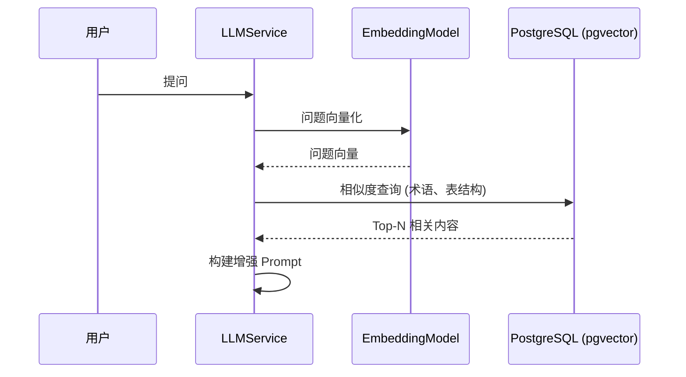

# 2.4 AI/LLM 架构设计

## 1. 设计理念

SQLBot 采用 **"服务导向编排 + LangChain 组件"** 的架构模式：

| 层级 | 职责 | 技术选型 |
| :--- | :--- | :--- |
| **编排层** | 业务流程控制 | 自研 `LLMService` |
| **抽象层** | 模型接口统一 | LangChain |
| **执行层** | 实际模型调用 | OpenAI/Azure/DeepSeek/vLLM |
| **向量层** | 语义检索 | HuggingFace + pgvector |

> 与 CrewAI 等 Agent 框架不同，SQLBot 追求 **SQL 生成的确定性**，因此选择手动控制流程而非自主 Agent。

---

## 2. 架构图



---

## 3. 核心组件

### 3.1 模型工厂 (LLMFactory)

```python
# apps/ai_model/model_factory.py

class LLMFactory:
    """大语言模型工厂类"""
    
    _llm_types: Dict[str, Type[BaseLLM]] = {
        "openai": OpenAILLM,
        "tongyi": OpenAILLM,
        "vllm": OpenAIvLLM,
        "azure": OpenAIAzureLLM,
    }
    
    @classmethod
    @lru_cache(maxsize=32)
    def create_llm(cls, config: LLMConfig) -> BaseLLM:
        """根据配置创建 LLM 实例（带缓存）"""
        llm_class = cls._llm_types.get(config.model_type)
        if not llm_class:
            raise ValueError(f"Unsupported LLM type: {config.model_type}")
        return llm_class(config)
    
    @classmethod
    def register_llm(cls, model_type: str, llm_class: Type[BaseLLM]):
        """注册新的模型类型"""
        cls._llm_types[model_type] = llm_class
```

### 3.2 配置结构 (LLMConfig)

```python
class LLMConfig(BaseModel):
    model_id: Optional[int] = None
    model_type: str          # openai/azure/vllm/tongyi
    model_name: str          # gpt-4/deepseek-chat/qwen-plus
    api_key: Optional[str]
    api_base_url: Optional[str]
    additional_params: Dict[str, Any] = {}
```

### 3.3 自定义 ChatOpenAI

```python
# apps/ai_model/openai/llm.py

class BaseChatOpenAI(ChatOpenAI):
    """扩展的 ChatOpenAI 类"""
    
    # 支持 DeepSeek 的 reasoning_content 提取
    def _convert_delta_to_message_chunk(self, _dict, default_class):
        additional_kwargs = {}
        if 'reasoning_content' in _dict:
            additional_kwargs['reasoning_content'] = _dict.get('reasoning_content')
        # ...
    
    # 精确追踪 Token 使用
    def _stream(self, *args, **kwargs):
        kwargs['stream_usage'] = True
        for chunk in super()._stream(*args, **kwargs):
            if chunk.message.usage_metadata is not None:
                self.usage_metadata = chunk.message.usage_metadata
            yield chunk
```

---

## 4. Embedding 模型

### 4.1 模型加载

```python
# apps/ai_model/embedding.py

class EmbeddingModelCache:
    @staticmethod
    def get_model(key: str = settings.DEFAULT_EMBEDDING_MODEL,
                  config: EmbeddingModelInfo = local_embedding_model) -> Embeddings:
        """获取 Embedding 模型实例（带缓存）"""
        model_instance = _embedding_model.get(key)
        if model_instance is None:
            with lock:
                model_instance = HuggingFaceEmbeddings(
                    model_name=config.name,
                    cache_folder=config.folder,
                    model_kwargs={'device': 'cpu'},
                    encode_kwargs={'normalize_embeddings': True}
                )
                _embedding_model[key] = model_instance
        return model_instance
```

### 4.2 向量检索流程



### 4.3 相似度计算

```python
# apps/datasource/embedding/table_embedding.py

def get_table_embedding(tables: list[dict], question: str):
    """计算问题与表结构的相似度"""
    model = EmbeddingModelCache.get_model()
    
    # 批量计算表结构向量
    text = [s.get('schema_table') for s in tables]
    results = model.embed_documents(text)
    
    # 计算问题向量
    q_embedding = model.embed_query(question)
    
    # 余弦相似度排序
    for index in range(len(results)):
        _list[index]['cosine_similarity'] = cosine_similarity(q_embedding, results[index])
    
    _list.sort(key=lambda x: x['cosine_similarity'], reverse=True)
    return _list[:settings.TABLE_EMBEDDING_COUNT]
```

---

## 5. LLMService 核心流程

```python
# apps/chat/task/llm.py

class LLMService:
    def run_task(self, in_chat=True, stream=True, finish_step=ChatFinishStep.GENERATE_CHART):
        """主流程入口"""
        
        # 1. 数据源选择（如未指定）
        if not self.ds:
            yield from self.select_datasource(_session)
        
        # 2. SQL 生成
        sql_res = self.generate_sql(_session)
        yield from sql_res
        
        # 3. 权限过滤
        sql = self.generate_filter(_session, sql, tables)
        
        # 4. SQL 执行
        result = self.execute_sql(sql)
        
        # 5. 图表生成
        chart_res = self.generate_chart(_session)
        yield from chart_res
```

### 5.1 Prompt 构建

```python
def init_messages(self):
    """初始化消息序列"""
    
    # 系统提示词
    self.sql_message.append(SystemMessage(content=self.chat_question.sys_question()))
    
    # 用户问题
    self.sql_message.append(HumanMessage(content=self.chat_question.user_question()))
    
    # 图表生成提示词
    self.chart_message.append(SystemMessage(content=self.chat_question.chart_sys_question()))
```

### 5.2 流式响应处理

```python
def generate_sql(self, _session: Session):
    """生成 SQL（流式）"""
    
    token_usage = {}
    res = process_stream(self.llm.stream(self.sql_message), token_usage)
    
    for chunk in res:
        if chunk.get('content'):
            full_sql_text += chunk.get('content')
        if chunk.get('reasoning_content'):
            full_thinking_text += chunk.get('reasoning_content')
        yield chunk
```

---

## 6. RAG 增强策略

### 6.1 上下文注入

| 类型 | 来源 | 注入方式 |
| :--- | :--- | :--- |
| **表结构** | CoreTable | 按相似度 Top-N 注入 |
| **术语定义** | Terminology | 按相似度匹配 |
| **SQL 示例** | DataTraining | 按相似度匹配 |
| **自定义提示词** | CustomPrompt | 直接追加 |

### 6.2 配置参数

| 参数 | 默认值 | 说明 |
| :--- | :---: | :--- |
| `EMBEDDING_ENABLED` | true | 是否启用向量检索 |
| `EMBEDDING_DEFAULT_SIMILARITY` | 0.4 | 最低相似度阈值 |
| `EMBEDDING_DEFAULT_TOP_COUNT` | 5 | 返回的最大匹配数 |
| `TABLE_EMBEDDING_COUNT` | 10 | 检索的相关表数量 |

---

## 7. 模型接入指南

### 7.1 接入新的 OpenAI 兼容模型

直接在系统管理中添加，无需代码改动：
1. 进入「系统管理 → AI 模型」
2. 点击「新增模型」
3. 填写模型名称、API 地址、API Key
4. 选择协议类型为「OpenAI 兼容」

### 7.2 接入非标准协议模型

1. 创建新的 LLM 类：

```python
# apps/ai_model/custom_llm.py

class CustomLLM(BaseLLM):
    def _init_llm(self) -> BaseChatModel:
        # 实现自定义初始化逻辑
        pass
```

2. 注册到工厂：

```python
# 在应用启动时注册
LLMFactory.register_llm("custom", CustomLLM)
```

---

## 8. 日志与监控

### 8.1 Token 使用追踪

```python
# 每次调用后记录
self.current_logs[OperationEnum.GENERATE_SQL] = end_log(
    session=session,
    log=self.current_logs[OperationEnum.GENERATE_SQL],
    full_message=[...],
    reasoning_content=full_thinking_text,
    token_usage=token_usage  # {'input_tokens': 1000, 'output_tokens': 200}
)
```

### 8.2 操作日志

| 操作类型 | 说明 |
| :--- | :--- |
| `GENERATE_SQL` | SQL 生成 |
| `GENERATE_SQL_WITH_PERMISSIONS` | 带权限的 SQL 改写 |
| `GENERATE_CHART` | 图表配置生成 |
| `GENERATE_ANALYSIS` | 智能分析 |
| `GENERATE_PREDICT` | 数据预测 |

---

## 9. 性能优化

| 策略 | 实现方式 |
| :--- | :--- |
| **模型缓存** | `LLMFactory` 使用 `lru_cache` |
| **Embedding 缓存** | `EmbeddingModelCache` 单例 |
| **批量向量化** | `embed_documents()` 批量处理 |
| **连接池** | ThreadPoolExecutor(max_workers=200) |
| **预计算向量** | 表结构、术语预先计算并存储 |
