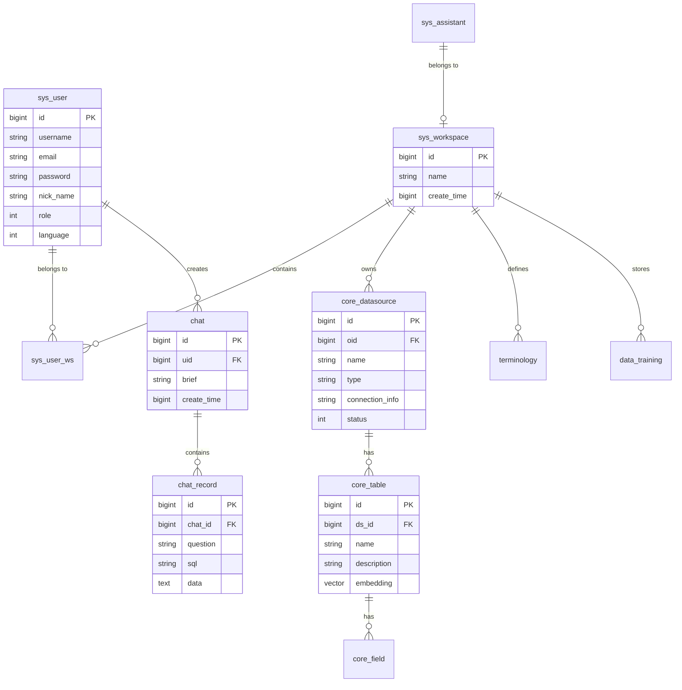

# 2.5 数据库设计

## 1. 数据库概述

SQLBot 使用 **PostgreSQL 16** 作为主数据库，并启用 **pgvector** 扩展支持向量检索。

| 特性 | 配置 |
| :--- | :--- |
| 数据库类型 | PostgreSQL 16 |
| 扩展插件 | pgvector (向量检索) |
| ORM 框架 | SQLModel + SQLAlchemy |
| 迁移工具 | Alembic |
| 连接池 | 默认 20 连接 |

---

## 2. ER 关系图



---

## 3. 核心表结构

### 3.1 用户与权限

#### sys_user (用户表)
| 字段 | 类型 | 说明 |
| :--- | :--- | :--- |
| id | BIGINT | 主键 (雪花算法) |
| username | VARCHAR(255) | 用户名 |
| email | VARCHAR(255) | 邮箱 |
| password | VARCHAR(255) | 密码 (加密) |
| nick_name | VARCHAR(255) | 昵称 |
| role | INT | 角色 (1=管理员, 2=普通用户) |
| language | INT | 语言偏好 |
| create_time | BIGINT | 创建时间戳 |

#### sys_workspace (工作空间表)
| 字段 | 类型 | 说明 |
| :--- | :--- | :--- |
| id | BIGINT | 主键 |
| name | VARCHAR(255) | 空间名称 |
| create_time | BIGINT | 创建时间戳 |

#### sys_user_ws (用户-工作空间关联)
| 字段 | 类型 | 说明 |
| :--- | :--- | :--- |
| id | BIGINT | 主键 |
| uid | BIGINT | 用户 ID |
| oid | BIGINT | 工作空间 ID |
| weight | INT | 权重/排序 |

---

### 3.2 数据源管理

#### core_datasource (数据源表)
| 字段 | 类型 | 说明 |
| :--- | :--- | :--- |
| id | BIGINT | 主键 |
| oid | BIGINT | 所属工作空间 |
| name | VARCHAR(255) | 数据源名称 |
| type | VARCHAR(50) | 类型 (mysql/pg/oracle...) |
| connection_info | TEXT | 连接信息 (加密) |
| status | INT | 状态 |
| create_time | BIGINT | 创建时间 |

#### core_table (表元数据)
| 字段 | 类型 | 说明 |
| :--- | :--- | :--- |
| id | BIGINT | 主键 |
| ds_id | BIGINT | 数据源 ID |
| name | VARCHAR(255) | 表名 |
| description | TEXT | 表描述 |
| embedding | VECTOR | 表结构向量 (pgvector) |
| sort | INT | 排序 |

#### core_field (字段元数据)
| 字段 | 类型 | 说明 |
| :--- | :--- | :--- |
| id | BIGINT | 主键 |
| table_id | BIGINT | 表 ID |
| name | VARCHAR(255) | 字段名 |
| type | VARCHAR(50) | 字段类型 |
| description | TEXT | 字段描述 |
| sort | INT | 排序 |

---

### 3.3 智能问答

#### chat (对话表)
| 字段 | 类型 | 说明 |
| :--- | :--- | :--- |
| id | BIGINT | 主键 |
| uid | BIGINT | 用户 ID |
| oid | BIGINT | 工作空间 ID |
| brief | VARCHAR(255) | 对话摘要 |
| brief_generate | BOOLEAN | 是否 AI 生成摘要 |
| origin | INT | 来源 (1=Web, 2=嵌入...) |
| create_time | BIGINT | 创建时间 |

#### chat_record (对话记录表)
| 字段 | 类型 | 说明 |
| :--- | :--- | :--- |
| id | BIGINT | 主键 |
| chat_id | BIGINT | 对话 ID |
| question | TEXT | 用户问题 |
| sql | TEXT | 生成的 SQL |
| data | TEXT | 执行结果 (JSON) |
| chart | TEXT | 图表配置 (JSON) |
| error | TEXT | 错误信息 |
| status | INT | 状态 |
| create_time | BIGINT | 创建时间 |

#### chat_log (AI 调用日志)
| 字段 | 类型 | 说明 |
| :--- | :--- | :--- |
| id | BIGINT | 主键 |
| record_id | BIGINT | 记录 ID |
| operate | VARCHAR(50) | 操作类型 |
| ai_modal_id | BIGINT | 模型 ID |
| full_message | TEXT | 完整消息 |
| reasoning_content | TEXT | 推理内容 |
| token_usage | JSONB | Token 使用统计 |

---

### 3.4 AI 增强

#### terminology (术语表)
| 字段 | 类型 | 说明 |
| :--- | :--- | :--- |
| id | BIGINT | 主键 |
| oid | BIGINT | 工作空间 ID |
| word | VARCHAR(255) | 术语词 |
| description | TEXT | 术语解释 |
| embedding | VECTOR | 术语向量 |
| enabled | BOOLEAN | 是否启用 |

#### data_training (训练数据表)
| 字段 | 类型 | 说明 |
| :--- | :--- | :--- |
| id | BIGINT | 主键 |
| oid | BIGINT | 工作空间 ID |
| question | TEXT | 示例问题 |
| sql | TEXT | 示例 SQL |
| embedding | VECTOR | 问题向量 |
| enabled | BOOLEAN | 是否启用 |

---

### 3.5 系统配置

#### ai_model (AI 模型配置)
| 字段 | 类型 | 说明 |
| :--- | :--- | :--- |
| id | BIGINT | 主键 |
| supplier | INT | 供应商 |
| name | VARCHAR(255) | 模型名称 |
| base_model | VARCHAR(255) | 基础模型 |
| api_key | VARCHAR(255) | API 密钥 (加密) |
| api_domain | VARCHAR(255) | API 地址 |
| protocol | INT | 协议类型 |
| default_model | BOOLEAN | 是否默认 |

#### sys_assistant (助手配置)
| 字段 | 类型 | 说明 |
| :--- | :--- | :--- |
| id | BIGINT | 主键 |
| name | VARCHAR(255) | 助手名称 |
| type | INT | 类型 |
| domain | VARCHAR(255) | 访问域名 |
| configuration | TEXT | 配置 (JSON) |
| app_id | VARCHAR(255) | 嵌入应用 ID |
| app_secret | VARCHAR(255) | 嵌入密钥 |

---

## 4. 索引策略

### 4.1 主键索引
所有表使用雪花算法生成的 BIGINT 作为主键。

### 4.2 外键索引
| 表 | 索引字段 | 说明 |
| :--- | :--- | :--- |
| core_table | ds_id | 数据源关联 |
| core_field | table_id | 表关联 |
| chat | uid, oid | 用户和工作空间 |
| chat_record | chat_id | 对话关联 |

### 4.3 向量索引
```sql
-- 术语表向量索引
CREATE INDEX idx_terminology_embedding ON terminology 
USING ivfflat (embedding vector_cosine_ops) WITH (lists = 100);

-- 训练数据向量索引
CREATE INDEX idx_data_training_embedding ON data_training 
USING ivfflat (embedding vector_cosine_ops) WITH (lists = 100);

-- 表结构向量索引
CREATE INDEX idx_core_table_embedding ON core_table 
USING ivfflat (embedding vector_cosine_ops) WITH (lists = 100);
```

---

## 5. 迁移管理

### 5.1 Alembic 配置
```ini
# alembic.ini
[alembic]
script_location = alembic
sqlalchemy.url = postgresql+psycopg://...
```

### 5.2 迁移文件结构
```
alembic/
├── env.py
├── script.py.mako
└── versions/
    ├── 001_ddl.py
    ├── 002_ddl_autogenerate.py
    ├── ...
    └── 057_update_sys_log.py
```

### 5.3 常用命令
```bash
# 创建新迁移
uv run alembic revision --autogenerate -m "描述"

# 执行迁移
uv run alembic upgrade head

# 回滚一个版本
uv run alembic downgrade -1

# 查看当前版本
uv run alembic current

# 查看迁移历史
uv run alembic history
```

---

## 6. 连接池配置

```python
# common/core/config.py
PG_POOL_SIZE: int = 20          # 连接池大小
PG_MAX_OVERFLOW: int = 30       # 最大溢出连接
PG_POOL_RECYCLE: int = 3600     # 连接回收时间(秒)
PG_POOL_PRE_PING: bool = True   # 连接前心跳检测
```

---

## 7. 数据安全

### 7.1 敏感数据加密
- API 密钥、数据库密码使用 AES 加密存储
- 加密密钥通过环境变量注入

### 7.2 数据隔离
- 工作空间级别的数据隔离
- 所有业务表包含 `oid` 字段标识所属工作空间

### 7.3 审计日志
- `sys_logs` 表记录关键操作
- `chat_log` 表记录 AI 调用详情
