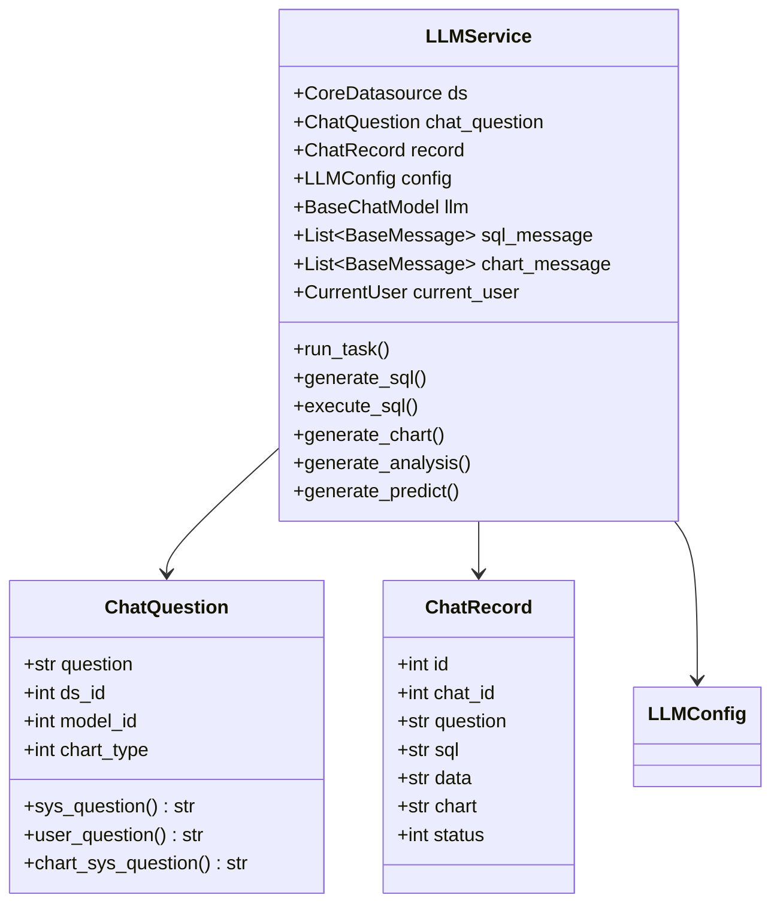
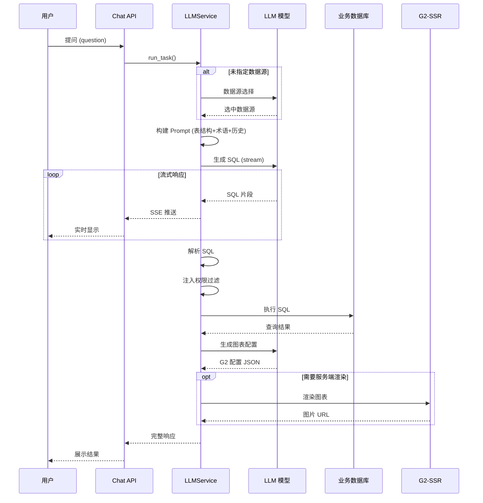
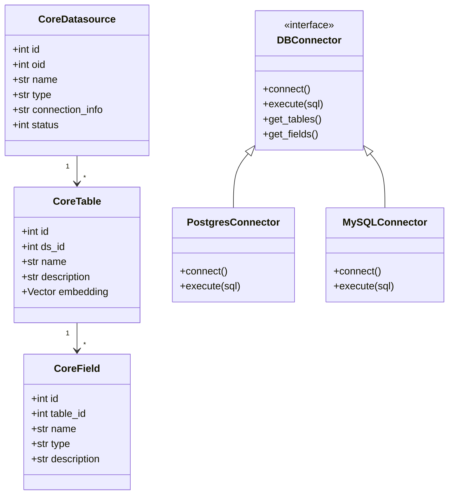
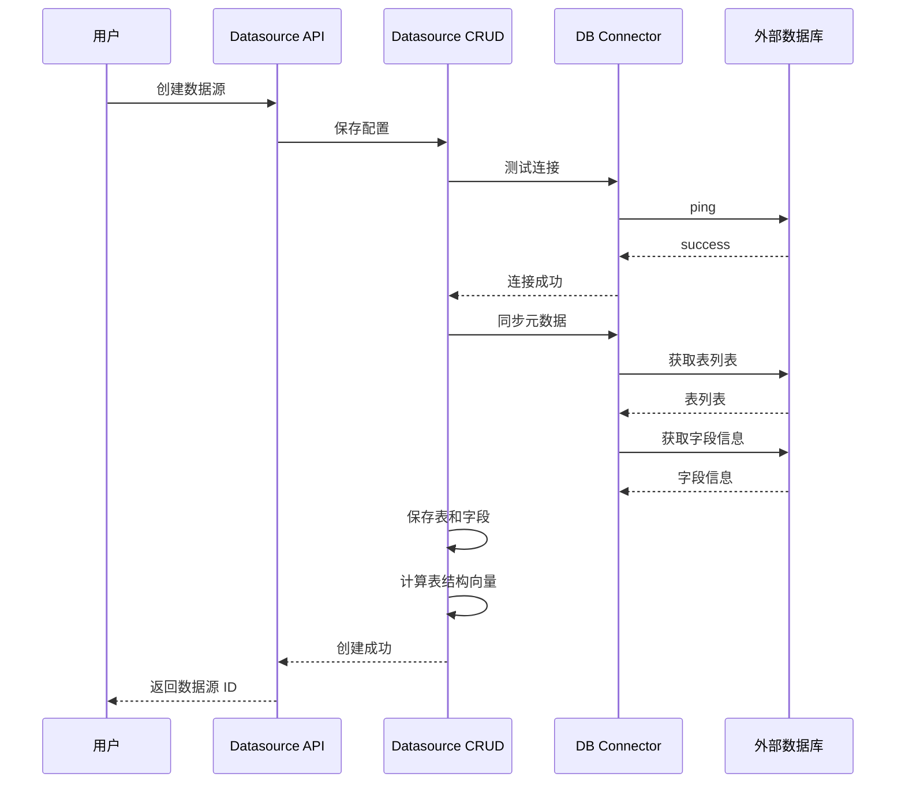
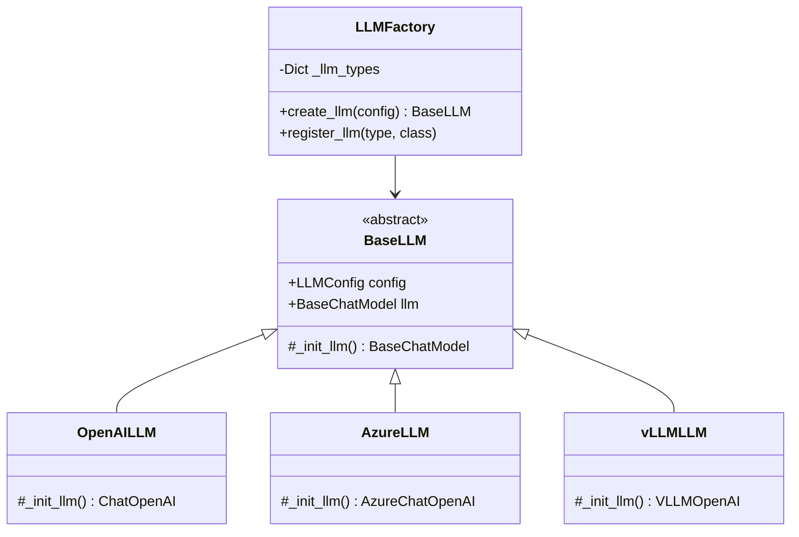
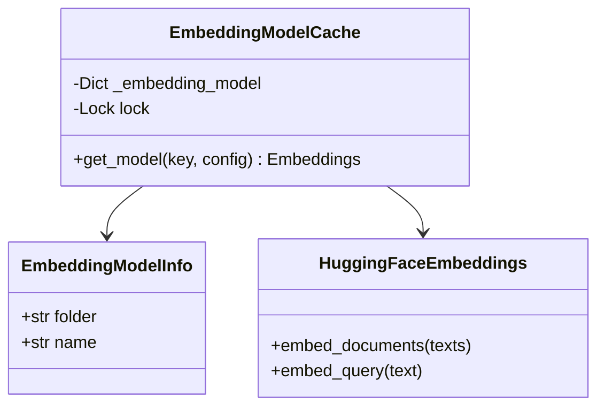
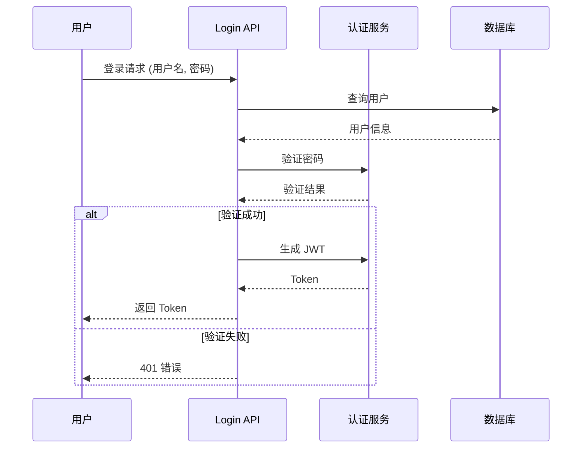
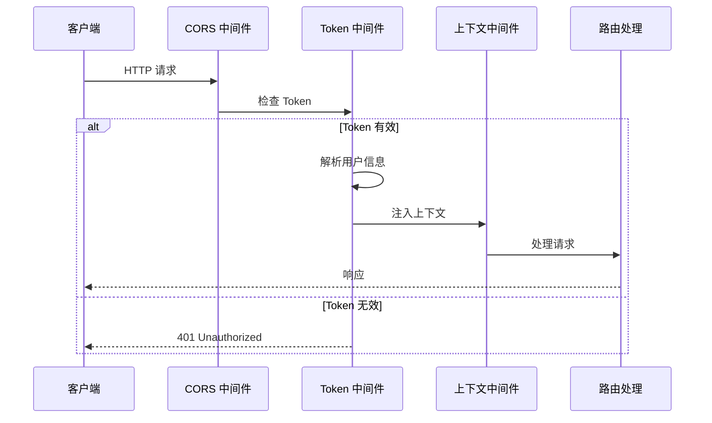

# 3.2 核心模块详细设计

## 1. 概述

本文档详细描述 SQLBot 核心业务模块的设计，包括类图、时序图和关键实现。

---

## 2. Chat 模块（智能问答）

### 2.1 类结构

### 2.2 问答流程时序图

### 2.3 核心方法说明

| 方法 | 职责 | 输入 | 输出 |
| :--- | :--- | :--- | :--- |
| `run_task()` | 主流程入口 | ChatQuestion | Generator (SSE) |
| `generate_sql()` | SQL 生成 | Prompt 消息 | SQL 字符串 |
| `execute_sql()` | SQL 执行 | SQL + 数据源 | DataFrame |
| `generate_chart()` | 图表生成 | 数据 + 问题 | G2 配置 |
| `generate_filter()` | 权限过滤 | SQL + 用户 | 改写后 SQL |

---

## 3. Datasource 模块（数据源管理）

### 3.1 类结构

### 3.2 数据源连接流程

---

## 4. AI Model 模块

### 4.1 工厂模式

### 4.2 Embedding 缓存模式

---

## 5. System 模块

### 5.1 认证流程

### 5.2 请求处理流程

---

## 6. 关键设计决策

### 6.1 为什么不使用 LangChain Agent？

| 维度 | LangChain Agent | SQLBot LLMService |
| :--- | :--- | :--- |
| **确定性** | 低（自主决策） | 高（固定流程） |
| **可控性** | 低 | 高 |
| **调试难度** | 高 | 低 |
| **SQL 安全** | 难以保证 | 可精确控制 |

### 6.2 为什么使用 SSE 而非 WebSocket？

| 维度 | SSE | WebSocket |
| :--- | :--- | :--- |
| **协议** | HTTP | 独立协议 |
| **复杂度** | 低 | 高 |
| **代理兼容** | 好 | 需特殊配置 |
| **双向通信** | 否 | 是 |
| **适用场景** | 服务端推送 | 双向实时 |

SQLBot 只需要服务端向客户端推送 AI 响应，SSE 是更简单的选择。

### 6.3 为什么使用 pgvector 而非专用向量数据库？

1. **简化架构**：无需额外部署向量数据库
2. **事务一致性**：向量与业务数据在同一事务中
3. **查询融合**：可在 SQL 中直接进行向量搜索
4. **性能足够**：当前数据规模下性能满足需求
