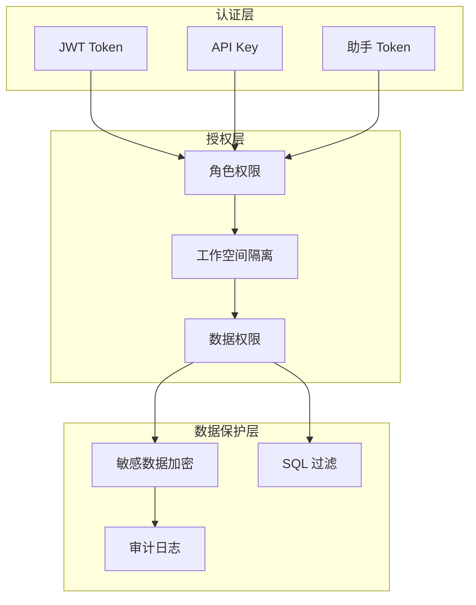
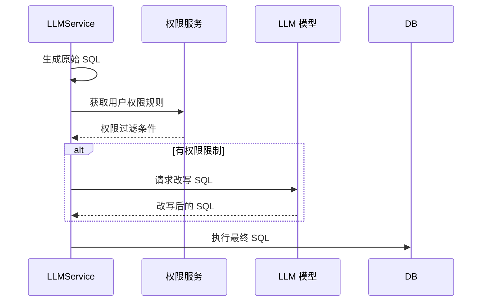

# 3.3 权限与安全设计

## 1. 安全架构概览



---

## 2. 认证机制

### 2.1 JWT Token 认证

#### Token 结构
```python
payload = {
    "sub": user_id,         # 用户 ID
    "exp": expiration_time, # 过期时间
    "iat": issued_at,       # 签发时间
    "oid": workspace_id,    # 当前工作空间
}
```

#### Token 生命周期

| 阶段 | 说明 |
| :--- | :--- |
| **生成** | 登录成功后，服务端签发 JWT |
| **传递** | 请求头 `X-SQLBOT-TOKEN` |
| **验证** | `TokenMiddleware` 自动验证 |
| **过期** | 默认 8 天，可配置 |
| **刷新** | 前端定期刷新 |

#### 配置参数

```python
# common/core/config.py
ACCESS_TOKEN_EXPIRE_MINUTES: int = 60 * 24 * 8  # 8 天
SECRET_KEY: str = secrets.token_urlsafe(32)
TOKEN_KEY: str = "X-SQLBOT-TOKEN"
```

### 2.2 API Key 认证

适用于第三方系统集成：

```python
# 请求头
Authorization: Bearer <access_key>:<secret_key>
```

| 字段 | 说明 |
| :--- | :--- |
| access_key | 公开标识符 |
| secret_key | 私密密钥（加密存储） |

### 2.3 助手 Token 认证

用于嵌入式场景：

```python
# 请求头
X-SQLBOT-ASSISTANT-TOKEN: <assistant_token>
```

---

## 3. 授权机制

### 3.1 角色权限 (RBAC)

| 角色 | 权限 |
| :--- | :--- |
| **管理员 (Admin)** | 全部权限，包括用户管理、系统配置 |
| **普通用户 (User)** | 问答、查看自己的数据、查看公开仪表盘 |

### 3.2 工作空间隔离

```mermaid
graph LR
    subgraph 工作空间 A
        DS_A[数据源 A]
        Term_A[术语库 A]
        Chat_A[对话 A]
    end
    
    subgraph 工作空间 B
        DS_B[数据源 B]
        Term_B[术语库 B]
        Chat_B[对话 B]
    end
    
    User_A[用户 A] --> 工作空间 A
    User_B[用户 B] --> 工作空间 B
    User_C[用户 C] --> 工作空间 A
    User_C --> 工作空间 B
```

**实现方式**：
- 所有业务表包含 `oid` 字段（工作空间 ID）
- 查询时自动添加 `WHERE oid = current_workspace_id`
- 用户通过 `sys_user_ws` 表关联到工作空间

### 3.3 数据权限

#### 行级权限 (Row-Level Security)

```python
# 权限规则示例
{
    "table": "orders",
    "column": "region",
    "operator": "=",
    "value": "${user.region}",  # 动态变量
}
```

**SQL 改写流程**：


#### 列级权限

| 配置项 | 说明 |
| :--- | :--- |
| 可见列 | 用户可查询的列 |
| 隐藏列 | 从表结构中隐藏 |
| 脱敏列 | 查询结果自动脱敏 |

---

## 4. 数据保护

### 4.1 敏感数据加密

| 数据类型 | 加密方式 | 存储位置 |
| :--- | :--- | :--- |
| 用户密码 | bcrypt | sys_user.password |
| 数据库密码 | AES | core_datasource.connection_info |
| API Key | AES | ai_model.api_key |
| Secret Key | AES | sys_apikey.secret_key |

#### 加密实现

```python
from Crypto.Cipher import AES

def encrypt(plain_text: str, key: bytes) -> str:
    """AES 加密"""
    cipher = AES.new(key, AES.MODE_GCM)
    ciphertext, tag = cipher.encrypt_and_digest(plain_text.encode())
    return base64.b64encode(cipher.nonce + tag + ciphertext).decode()

def decrypt(encrypted: str, key: bytes) -> str:
    """AES 解密"""
    data = base64.b64decode(encrypted)
    nonce, tag, ciphertext = data[:16], data[16:32], data[32:]
    cipher = AES.new(key, AES.MODE_GCM, nonce=nonce)
    return cipher.decrypt_and_verify(ciphertext, tag).decode()
```

### 4.2 SQL 注入防护

| 防护层 | 措施 |
| :--- | :--- |
| **ORM 层** | SQLModel/SQLAlchemy 参数化查询 |
| **AI 生成层** | Prompt 约束 + SQL 解析验证 |
| **执行层** | 只读连接（推荐） |

### 4.3 敏感信息脱敏

```python
# 日志脱敏
def mask_sensitive(text: str) -> str:
    # 隐藏密码
    text = re.sub(r'password=\S+', 'password=***', text)
    # 隐藏 API Key
    text = re.sub(r'(sk-|api_key=)\S+', r'\1***', text)
    return text
```

---

## 5. 审计日志

### 5.1 日志内容

| 日志类型 | 记录内容 |
| :--- | :--- |
| **操作日志** | 用户操作（登录、创建、修改、删除） |
| **AI 调用日志** | 模型调用、Prompt、Token 使用 |
| **查询日志** | SQL 执行记录 |
| **系统日志** | 启动、错误、异常 |

### 5.2 日志表结构

```sql
CREATE TABLE sys_logs (
    id BIGINT PRIMARY KEY,
    uid BIGINT,           -- 用户 ID
    oid BIGINT,           -- 工作空间 ID
    operate VARCHAR(50),  -- 操作类型
    module VARCHAR(50),   -- 模块名
    content TEXT,         -- 操作内容
    ip VARCHAR(50),       -- IP 地址
    create_time BIGINT    -- 时间戳
);
```

---

## 6. 安全配置清单

### 6.1 生产环境必须配置

| 配置项 | 说明 | 默认值 |
| :--- | :--- | :--- |
| `SECRET_KEY` | JWT 签名密钥 | 随机生成 |
| `DEFAULT_PWD` | 默认密码（需修改） | SQLBot@123456 |
| HTTPS | 启用 HTTPS | 否 |
| CORS | 限制跨域来源 | * |

### 6.2 安全加固建议

> [!IMPORTANT]
> 1. **修改默认密码**：首次登录后立即修改 admin 密码
> 2. **启用 HTTPS**：生产环境必须使用 HTTPS
> 3. **限制 CORS**：只允许可信域名访问
> 4. **定期轮换密钥**：定期更换 SECRET_KEY
> 5. **最小权限**：数据库连接使用只读账户

---

## 7. 安全检查清单

- [ ] 已修改默认管理员密码
- [ ] 已配置 HTTPS
- [ ] 已限制 CORS 来源
- [ ] 已配置强 SECRET_KEY
- [ ] 数据库使用只读账户
- [ ] 已启用审计日志
- [ ] 已配置备份策略
- [ ] 已测试权限隔离
