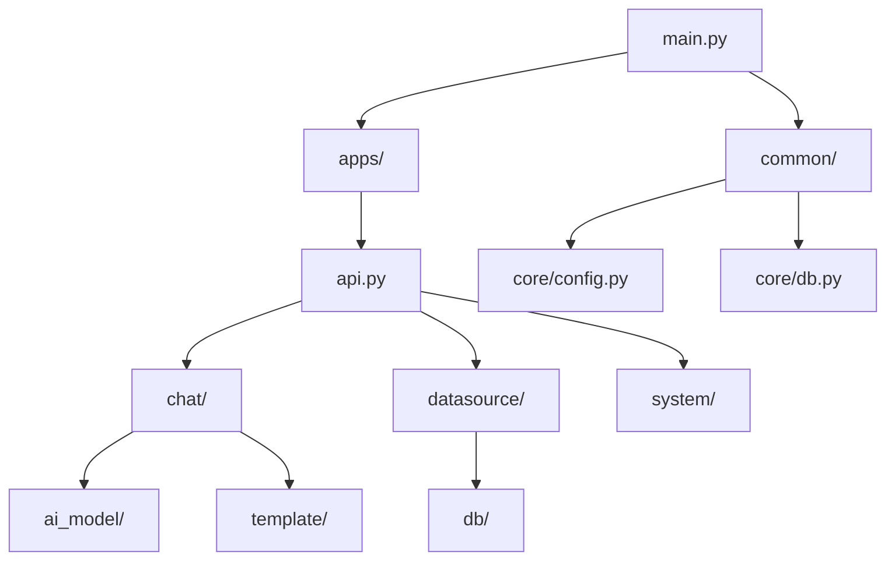

# 4.1 后端代码结构说明

## 1. 目录结构

```
backend/
├── main.py                 # 🚀 应用入口
├── pyproject.toml          # 📦 项目配置与依赖
├── uv.lock                 # 🔒 依赖锁定文件
├── alembic.ini             # 🗃️ 数据库迁移配置
│
├── apps/                   # 📱 业务模块
│   ├── api.py              # 路由注册中心
│   ├── ai_model/           # AI 模型管理
│   ├── chat/               # 智能问答 ⭐核心
│   ├── dashboard/          # 仪表盘
│   ├── data_training/      # 训练数据
│   ├── datasource/         # 数据源管理
│   ├── db/                 # 数据库连接器
│   ├── mcp/                # MCP 协议
│   ├── settings/           # 系统设置
│   ├── swagger/            # API 文档
│   ├── system/             # 系统管理 ⭐核心
│   ├── template/           # 提示词模板
│   └── terminology/        # 术语库
│
├── common/                 # 🔧 公共模块
│   ├── core/               # 核心配置
│   ├── audit/              # 审计日志
│   ├── error.py            # 异常定义
│   └── utils/              # 工具函数
│
├── alembic/                # 🗃️ 数据库迁移
│   ├── env.py
│   └── versions/           # 迁移版本文件
│
├── locales/                # 🌐 国际化
├── templates/              # 📝 Prompt 模板
├── models/                 # 🤖 本地 AI 模型
├── scripts/                # 📜 脚本工具
├── data/                   # 📁 数据目录
├── logs/                   # 📋 日志目录
└── images/                 # 🖼️ 图片目录
```

---

## 2. 核心模块详解

### 2.1 apps/ 业务模块

每个业务模块遵循统一的目录结构：

```
apps/{module_name}/
├── __init__.py
├── api/                    # API 路由层
│   └── {module_name}.py
├── crud/                   # 数据操作层
│   └── {module_name}.py
├── models/                 # 数据模型层
│   └── {module_name}_model.py
└── schemas/                # 数据结构层
    └── {module_name}_schema.py
```

---

### 2.2 各模块职责

| 模块 | 路径 | 核心职责 |
| :--- | :--- | :--- |
| **chat** | `apps/chat/` | 智能问答核心逻辑 |
| **datasource** | `apps/datasource/` | 数据源连接与元数据管理 |
| **system** | `apps/system/` | 用户、工作空间、AI 模型、助手管理 |
| **ai_model** | `apps/ai_model/` | LLM 工厂、Embedding 模型 |
| **terminology** | `apps/terminology/` | 术语库管理 |
| **data_training** | `apps/data_training/` | SQL 训练数据管理 |
| **dashboard** | `apps/dashboard/` | 仪表盘与看板 |
| **mcp** | `apps/mcp/` | Model Context Protocol 服务 |
| **settings** | `apps/settings/` | 系统参数配置 |
| **db** | `apps/db/` | 各类数据库连接器 |

---

### 2.3 common/ 公共模块

| 目录 | 核心文件 | 职责 |
| :--- | :--- | :--- |
| `core/` | `config.py` | 配置管理 (Settings) |
| | `db.py` | SQLAlchemy 引擎 |
| | `deps.py` | FastAPI 依赖注入 |
| | `models.py` | 基础模型 (SnowflakeBase) |
| | `schemas.py` | 基础 Schema |
| | `response_middleware.py` | 响应格式化中间件 |
| | `sqlbot_cache.py` | 缓存管理 |
| `audit/` | | 审计日志 |
| `utils/` | `utils.py` | 日志工具 (SQLBotLogUtil) |
| | `embedding_threads.py` | 向量填充线程 |

---

## 3. 关键文件索引

### 3.1 入口与配置

| 文件 | 路径 | 说明 |
| :--- | :--- | :--- |
| 应用入口 | `main.py` | FastAPI 应用创建、中间件、生命周期 |
| 配置管理 | `common/core/config.py` | 环境变量、Settings 类 |
| 数据库连接 | `common/core/db.py` | SQLAlchemy 引擎配置 |
| 路由注册 | `apps/api.py` | 所有 API 路由的汇总注册 |

### 3.2 智能问答

| 文件 | 路径 | 说明 |
| :--- | :--- | :--- |
| **LLMService** | `apps/chat/task/llm.py` | 问答核心服务类 |
| 问答 API | `apps/chat/api/chat.py` | 问答相关接口 |
| 聊天模型 | `apps/chat/models/chat_model.py` | Chat, ChatRecord 等 |
| 问题构建 | `apps/chat/task/chat_question.py` | Prompt 构建逻辑 |

### 3.3 AI 模型

| 文件 | 路径 | 说明 |
| :--- | :--- | :--- |
| 模型工厂 | `apps/ai_model/model_factory.py` | LLMFactory 类 |
| Embedding | `apps/ai_model/embedding.py` | Embedding 模型管理 |
| 自定义 LLM | `apps/ai_model/openai/llm.py` | BaseChatOpenAI 类 |

### 3.4 数据源

| 文件 | 路径 | 说明 |
| :--- | :--- | :--- |
| 数据源 API | `apps/datasource/api/datasource.py` | 数据源 CRUD API |
| 数据源模型 | `apps/datasource/models/datasource.py` | CoreDatasource 等 |
| 数据库连接器 | `apps/datasource/db/` | 各数据库连接实现 |
| 表向量化 | `apps/datasource/embedding/` | 表结构向量计算 |

### 3.5 系统管理

| 文件 | 路径 | 说明 |
| :--- | :--- | :--- |
| 用户 API | `apps/system/api/user.py` | 用户管理 |
| 登录 API | `apps/system/api/login.py` | 认证登录 |
| Token 中间件 | `apps/system/middleware/auth.py` | JWT 认证 |
| 系统模型 | `apps/system/models/system_model.py` | 用户、工作空间等 |

---

## 4. 命名规范

### 4.1 文件命名

| 类型 | 命名规则 | 示例 |
| :--- | :--- | :--- |
| 模块目录 | 小写下划线 | `data_training/` |
| Python 文件 | 小写下划线 | `chat_model.py` |
| API 文件 | 与模块同名 | `chat.py` |
| 模型文件 | `{模块}_model.py` | `datasource_model.py` |
| Schema 文件 | `{模块}_schema.py` | `chat_schema.py` |

### 4.2 类命名

| 类型 | 命名规则 | 示例 |
| :--- | :--- | :--- |
| 数据库模型 | PascalCase + Model | `ChatRecordModel` |
| Schema | PascalCase + 用途 | `ChatCreate`, `ChatResponse` |
| Service | PascalCase + Service | `LLMService` |
| 工厂类 | PascalCase + Factory | `LLMFactory` |

### 4.3 函数命名

| 类型 | 命名规则 | 示例 |
| :--- | :--- | :--- |
| API 端点 | 动词小写 | `create_chat()`, `get_list()` |
| CRUD 函数 | 动作_对象 | `create_datasource()` |
| 工具函数 | 动词_描述 | `fill_empty_embeddings()` |

---

## 5. 依赖关系



---

## 6. 扩展指南

### 6.1 添加新业务模块

1. 创建模块目录：
```bash
mkdir -p apps/new_module/{api,crud,models,schemas}
touch apps/new_module/__init__.py
```

2. 按照标准结构创建文件

3. 在 `apps/api.py` 中注册路由：
```python
from apps.new_module.api import new_module
api_router.include_router(new_module.router)
```

### 6.2 添加新数据库连接器

在 `apps/datasource/db/` 下创建新文件，继承基础连接器接口。

### 6.3 添加新 LLM 供应商

在 `apps/ai_model/` 下创建新类，并注册到 `LLMFactory`。
