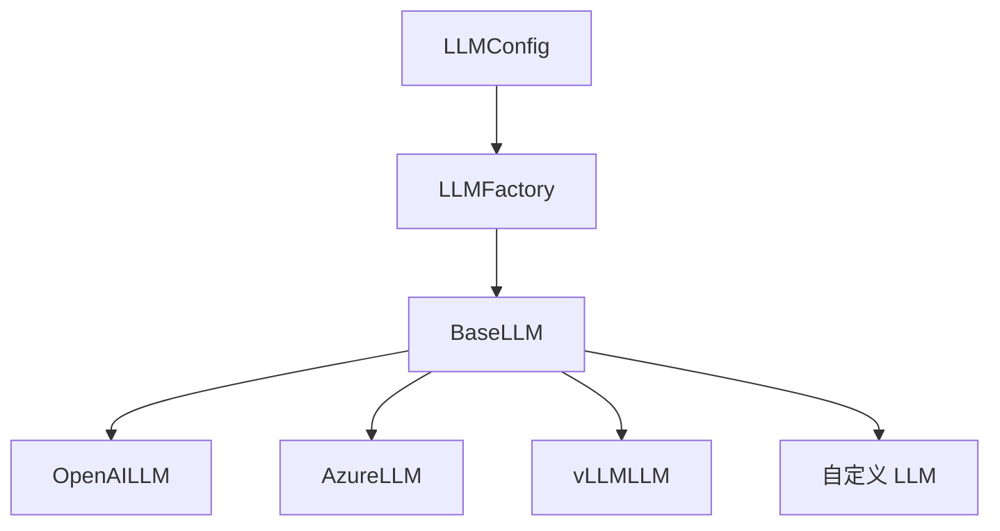

# 4.4 AI 模型接入指南

## 1. 概述

SQLBot 支持多种 LLM 供应商的接入，包括：
- OpenAI (GPT-4, GPT-3.5)
- Azure OpenAI
- DeepSeek
- 通义千问 (Qwen)
- 本地 vLLM 部署

---

## 2. 通过管理界面接入

### 2.1 接入步骤

1. 登录 SQLBot 管理后台
2. 进入「系统管理 → AI 模型」
3. 点击「新增模型」
4. 填写模型信息

### 2.2 配置字段说明

| 字段 | 说明 | 示例 |
| :--- | :--- | :--- |
| **模型名称** | 显示名称 | DeepSeek Chat |
| **基础模型** | 模型标识符 | deepseek-chat |
| **API 地址** | 模型服务地址 | https://api.deepseek.com |
| **API 密钥** | 认证密钥 | sk-xxx |
| **协议类型** | OpenAI 兼容 / 其他 | OpenAI 兼容 |
| **设为默认** | 是否作为默认模型 | 是 |

---

## 3. 常见模型配置示例

### 3.1 OpenAI

| 配置项 | 值 |
| :--- | :--- |
| API 地址 | `https://api.openai.com/v1` |
| 基础模型 | `gpt-4` 或 `gpt-3.5-turbo` |
| 协议类型 | OpenAI 兼容 |

### 3.2 DeepSeek

| 配置项 | 值 |
| :--- | :--- |
| API 地址 | `https://api.deepseek.com` |
| 基础模型 | `deepseek-chat` 或 `deepseek-reasoner` |
| 协议类型 | OpenAI 兼容 |

### 3.3 通义千问

| 配置项 | 值 |
| :--- | :--- |
| API 地址 | `https://dashscope.aliyuncs.com/compatible-mode/v1` |
| 基础模型 | `qwen-plus` 或 `qwen-turbo` |
| 协议类型 | OpenAI 兼容 |

### 3.4 Azure OpenAI

| 配置项 | 值 |
| :--- | :--- |
| API 地址 | `https://your-resource.openai.azure.com` |
| 基础模型 | 你的部署名 |
| 协议类型 | Azure |
| 额外配置 | `api_version`: `2024-02-15-preview` |

---

## 4. 代码级接入

### 4.1 架构说明



### 4.2 创建自定义 LLM 类

```python
# apps/ai_model/custom_llm.py

from langchain.chat_models.base import BaseChatModel
from apps.ai_model.model_factory import BaseLLM, LLMConfig

class CustomLLM(BaseLLM):
    """自定义 LLM 实现"""
    
    def _init_llm(self) -> BaseChatModel:
        """初始化 LLM 实例"""
        # 使用自定义的 LangChain 模型
        from langchain_custom import CustomChatModel
        
        return CustomChatModel(
            model=self.config.model_name,
            api_key=self.config.api_key,
            base_url=self.config.api_base_url,
            **self.config.additional_params
        )
```

### 4.3 注册到工厂

```python
# apps/ai_model/model_factory.py

class LLMFactory:
    _llm_types: Dict[str, Type[BaseLLM]] = {
        "openai": OpenAILLM,
        "tongyi": OpenAILLM,
        "vllm": OpenAIvLLM,
        "azure": OpenAIAzureLLM,
        "custom": CustomLLM,  # 新增
    }
```

### 4.4 使用自定义模型

在数据库 `ai_model` 表中添加记录时，将协议类型设置为对应的 key（如 `custom`）。

---

## 5. Embedding 模型配置

### 5.1 默认模型

系统默认使用 `shibing624/text2vec-base-chinese`，这是一个中文语义嵌入模型。

### 5.2 配置说明

| 配置项 | 环境变量 | 默认值 |
| :--- | :--- | :--- |
| 模型名称 | `DEFAULT_EMBEDDING_MODEL` | shibing624/text2vec-base-chinese |
| 本地路径 | `LOCAL_MODEL_PATH` | /opt/sqlbot/models |
| 是否启用 | `EMBEDDING_ENABLED` | true |
| 相似度阈值 | `EMBEDDING_DEFAULT_SIMILARITY` | 0.4 |
| 返回数量 | `EMBEDDING_DEFAULT_TOP_COUNT` | 5 |

### 5.3 切换 Embedding 模型

修改 `embedding.py` 中的模型配置：

```python
# apps/ai_model/embedding.py

# 方式一：使用本地模型
local_embedding_model = EmbeddingModelInfo(
    folder='/opt/sqlbot/models',
    name='/opt/sqlbot/models/embedding/bge-base-zh-v1.5'
)

# 方式二：使用在线模型（自动下载）
local_embedding_model = EmbeddingModelInfo(
    folder='/opt/sqlbot/models',
    name='BAAI/bge-base-zh-v1.5'  # HuggingFace 模型 ID
)
```

---

## 6. 高级配置

### 6.1 模型参数

可在管理界面的「附加配置」中设置：

| 参数 | 说明 | 示例 |
| :--- | :--- | :--- |
| `temperature` | 创造性 (0-2) | 0.7 |
| `max_tokens` | 最大输出长度 | 4096 |
| `top_p` | 核采样 | 0.9 |
| `frequency_penalty` | 频率惩罚 | 0 |
| `presence_penalty` | 存在惩罚 | 0 |

### 6.2 Azure 特殊配置

```json
{
  "api_version": "2024-02-15-preview",
  "deployment_name": "your-deployment-name"
}
```

---

## 7. 调试与测试

### 7.1 测试模型连接

```python
# 在 Python 交互环境中测试

from apps.ai_model.model_factory import LLMFactory, LLMConfig

config = LLMConfig(
    model_type="openai",
    model_name="deepseek-chat",
    api_key="your-api-key",
    api_base_url="https://api.deepseek.com",
    additional_params={"temperature": 0.7}
)

llm = LLMFactory.create_llm(config)
response = llm.llm.invoke("你好，请介绍一下自己")
print(response.content)
```

### 7.2 查看 Token 使用

```python
# 获取最后一次调用的 Token 使用情况
usage = llm.llm.get_last_generation_info()
print(f"输入: {usage['input_tokens']}, 输出: {usage['output_tokens']}")
```

---

## 8. 常见问题

### Q1: 模型连接超时

**可能原因**：
- 网络问题
- API 地址错误
- 防火墙限制

**解决方案**：
1. 检查 API 地址是否正确
2. 测试网络连通性：`curl -I https://api.deepseek.com`
3. 检查是否需要配置代理

### Q2: 认证失败

**可能原因**：
- API 密钥错误或过期
- 账户余额不足

**解决方案**：
1. 验证 API 密钥是否正确
2. 登录供应商控制台检查账户状态

### Q3: 模型不支持流式输出

**解决方案**：
确保使用的是 Chat 模型而非 Completion 模型。在模型配置中设置 `streaming=True`。

### Q4: Embedding 模型下载失败

**可能原因**：
- 网络无法访问 HuggingFace
- 磁盘空间不足

**解决方案**：
1. 配置 HuggingFace 镜像：`HF_ENDPOINT=https://hf-mirror.com`
2. 或手动下载模型文件到 `LOCAL_MODEL_PATH`

---

## 9. 性能优化

| 策略 | 说明 |
| :--- | :--- |
| **模型缓存** | LLMFactory 使用 LRU 缓存复用模型实例 |
| **连接池** | ThreadPoolExecutor 管理并发请求 |
| **Embedding 预计算** | 术语和表结构启动时预计算向量 |
| **批量处理** | embed_documents() 批量生成向量 |
