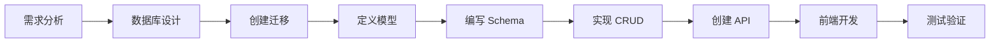

# 4.5 新功能开发模板

## 1. 概述

本文档提供了在 SQLBot 中开发新功能的标准流程和模板代码，帮助开发者快速上手。

---

## 2. 开发流程



---

## 3. 后端开发模板

### 3.1 步骤一：创建数据库迁移

```bash
cd backend
uv run alembic revision --autogenerate -m "add_new_feature"
```

编辑生成的迁移文件：

```python
# alembic/versions/xxx_add_new_feature.py

def upgrade() -> None:
    op.create_table(
        'new_feature',
        sa.Column('id', sa.BigInteger(), primary_key=True),
        sa.Column('name', sa.String(255), nullable=False),
        sa.Column('oid', sa.BigInteger(), nullable=True),
        sa.Column('create_time', sa.BigInteger(), default=0),
    )

def downgrade() -> None:
    op.drop_table('new_feature')
```

### 3.2 步骤二：定义数据模型

```python
# apps/new_feature/models/new_feature_model.py

from typing import Optional
from sqlmodel import Field, SQLModel, BigInteger
from common.core.models import SnowflakeBase

class NewFeatureBase(SQLModel):
    """基础字段定义"""
    name: str = Field(max_length=255, nullable=False)
    description: Optional[str] = Field(default=None, nullable=True)
    oid: Optional[int] = Field(default=None, sa_type=BigInteger())

class NewFeatureModel(SnowflakeBase, NewFeatureBase, table=True):
    """数据库表模型"""
    __tablename__ = "new_feature"
    create_time: int = Field(default=0, sa_type=BigInteger())
```

### 3.3 步骤三：定义 Schema

```python
# apps/new_feature/schemas/new_feature_schema.py

from typing import Optional, List
from pydantic import BaseModel

class NewFeatureCreate(BaseModel):
    """创建请求"""
    name: str
    description: Optional[str] = None

class NewFeatureUpdate(BaseModel):
    """更新请求"""
    name: Optional[str] = None
    description: Optional[str] = None

class NewFeatureResponse(BaseModel):
    """响应模型"""
    id: int
    name: str
    description: Optional[str]
    create_time: int
    
    class Config:
        from_attributes = True

class NewFeatureListResponse(BaseModel):
    """列表响应"""
    items: List[NewFeatureResponse]
    total: int
```

### 3.4 步骤四：实现 CRUD

```python
# apps/new_feature/crud/new_feature.py

import time
from typing import Optional, List
from sqlmodel import Session, select, func

from apps.new_feature.models.new_feature_model import NewFeatureModel
from apps.new_feature.schemas.new_feature_schema import NewFeatureCreate, NewFeatureUpdate


def create_new_feature(session: Session, data: NewFeatureCreate, oid: int) -> NewFeatureModel:
    """创建记录"""
    db_obj = NewFeatureModel(
        **data.model_dump(),
        oid=oid,
        create_time=int(time.time() * 1000)
    )
    session.add(db_obj)
    session.commit()
    session.refresh(db_obj)
    return db_obj


def get_new_feature(session: Session, id: int) -> Optional[NewFeatureModel]:
    """获取单条记录"""
    return session.get(NewFeatureModel, id)


def get_new_feature_list(
    session: Session, 
    oid: int, 
    skip: int = 0, 
    limit: int = 20
) -> tuple[List[NewFeatureModel], int]:
    """获取列表"""
    query = select(NewFeatureModel).where(NewFeatureModel.oid == oid)
    
    # 获取总数
    count_query = select(func.count()).select_from(query.subquery())
    total = session.exec(count_query).one()
    
    # 分页查询
    items = session.exec(
        query.offset(skip).limit(limit).order_by(NewFeatureModel.create_time.desc())
    ).all()
    
    return list(items), total


def update_new_feature(
    session: Session, 
    id: int, 
    data: NewFeatureUpdate
) -> Optional[NewFeatureModel]:
    """更新记录"""
    db_obj = session.get(NewFeatureModel, id)
    if not db_obj:
        return None
    
    update_data = data.model_dump(exclude_unset=True)
    for key, value in update_data.items():
        setattr(db_obj, key, value)
    
    session.commit()
    session.refresh(db_obj)
    return db_obj


def delete_new_feature(session: Session, id: int) -> bool:
    """删除记录"""
    db_obj = session.get(NewFeatureModel, id)
    if not db_obj:
        return False
    session.delete(db_obj)
    session.commit()
    return True
```

### 3.5 步骤五：创建 API 路由

```python
# apps/new_feature/api/new_feature.py

from typing import Annotated
from fastapi import APIRouter, Depends, HTTPException, Query
from sqlmodel import Session

from common.core.db import get_session
from common.core.deps import get_current_user, get_current_workspace
from apps.new_feature.crud import new_feature as crud
from apps.new_feature.schemas.new_feature_schema import (
    NewFeatureCreate, 
    NewFeatureUpdate,
    NewFeatureResponse, 
    NewFeatureListResponse
)

router = APIRouter(prefix="/new-feature", tags=["NewFeature"])


@router.post("", response_model=NewFeatureResponse, summary="创建新功能")
def create(
    data: NewFeatureCreate,
    session: Annotated[Session, Depends(get_session)],
    current_user = Depends(get_current_user),
    oid: int = Depends(get_current_workspace)
):
    """创建新功能记录"""
    return crud.create_new_feature(session, data, oid)


@router.get("", response_model=NewFeatureListResponse, summary="获取列表")
def list_all(
    session: Annotated[Session, Depends(get_session)],
    current_user = Depends(get_current_user),
    oid: int = Depends(get_current_workspace),
    skip: int = Query(0, ge=0),
    limit: int = Query(20, ge=1, le=100)
):
    """获取新功能列表"""
    items, total = crud.get_new_feature_list(session, oid, skip, limit)
    return NewFeatureListResponse(items=items, total=total)


@router.get("/{id}", response_model=NewFeatureResponse, summary="获取详情")
def get_one(
    id: int,
    session: Annotated[Session, Depends(get_session)],
    current_user = Depends(get_current_user)
):
    """获取单条记录"""
    db_obj = crud.get_new_feature(session, id)
    if not db_obj:
        raise HTTPException(status_code=404, detail="记录不存在")
    return db_obj


@router.put("/{id}", response_model=NewFeatureResponse, summary="更新")
def update(
    id: int,
    data: NewFeatureUpdate,
    session: Annotated[Session, Depends(get_session)],
    current_user = Depends(get_current_user)
):
    """更新记录"""
    db_obj = crud.update_new_feature(session, id, data)
    if not db_obj:
        raise HTTPException(status_code=404, detail="记录不存在")
    return db_obj


@router.delete("/{id}", summary="删除")
def delete(
    id: int,
    session: Annotated[Session, Depends(get_session)],
    current_user = Depends(get_current_user)
):
    """删除记录"""
    success = crud.delete_new_feature(session, id)
    if not success:
        raise HTTPException(status_code=404, detail="记录不存在")
    return {"message": "删除成功"}
```

### 3.6 步骤六：注册路由

```python
# apps/api.py

from apps.new_feature.api import new_feature

# 添加路由
api_router.include_router(new_feature.router)
```

---

## 4. 前端开发模板

### 4.1 创建 API 模块

```typescript
// src/api/newFeature.ts

import request from '@/utils/request'

export interface NewFeature {
  id: number
  name: string
  description?: string
  create_time: number
}

export interface NewFeatureCreate {
  name: string
  description?: string
}

// 获取列表
export function getNewFeatureList(params: { skip?: number; limit?: number }) {
  return request.get<{ items: NewFeature[]; total: number }>('/new-feature', { params })
}

// 获取详情
export function getNewFeature(id: number) {
  return request.get<NewFeature>(`/new-feature/${id}`)
}

// 创建
export function createNewFeature(data: NewFeatureCreate) {
  return request.post<NewFeature>('/new-feature', data)
}

// 更新
export function updateNewFeature(id: number, data: Partial<NewFeatureCreate>) {
  return request.put<NewFeature>(`/new-feature/${id}`, data)
}

// 删除
export function deleteNewFeature(id: number) {
  return request.delete(`/new-feature/${id}`)
}
```

### 4.2 创建视图组件

```vue
<!-- src/views/new-feature/index.vue -->

<template>
  <div class="new-feature-container">
    <div class="header">
      <h2>新功能管理</h2>
      <el-button type="primary" @click="showCreate">新增</el-button>
    </div>
    
    <el-table :data="list" v-loading="loading">
      <el-table-column prop="name" label="名称" />
      <el-table-column prop="description" label="描述" />
      <el-table-column prop="create_time" label="创建时间">
        <template #default="{ row }">
          {{ formatTime(row.create_time) }}
        </template>
      </el-table-column>
      <el-table-column label="操作" width="150">
        <template #default="{ row }">
          <el-button size="small" @click="showEdit(row)">编辑</el-button>
          <el-button size="small" type="danger" @click="handleDelete(row)">删除</el-button>
        </template>
      </el-table-column>
    </el-table>
    
    <el-pagination
      v-model:current-page="page"
      :total="total"
      :page-size="20"
      @current-change="loadData"
    />
    
    <!-- 编辑弹窗 -->
    <el-dialog v-model="dialogVisible" :title="editId ? '编辑' : '新增'">
      <el-form :model="form" label-width="80px">
        <el-form-item label="名称" required>
          <el-input v-model="form.name" />
        </el-form-item>
        <el-form-item label="描述">
          <el-input v-model="form.description" type="textarea" />
        </el-form-item>
      </el-form>
      <template #footer>
        <el-button @click="dialogVisible = false">取消</el-button>
        <el-button type="primary" @click="handleSubmit">确定</el-button>
      </template>
    </el-dialog>
  </div>
</template>

<script setup lang="ts">
import { ref, onMounted } from 'vue'
import { ElMessage, ElMessageBox } from 'element-plus'
import dayjs from 'dayjs'
import {
  getNewFeatureList,
  createNewFeature,
  updateNewFeature,
  deleteNewFeature,
  type NewFeature
} from '@/api/newFeature'

const loading = ref(false)
const list = ref<NewFeature[]>([])
const total = ref(0)
const page = ref(1)

const dialogVisible = ref(false)
const editId = ref<number | null>(null)
const form = ref({ name: '', description: '' })

const formatTime = (ts: number) => dayjs(ts).format('YYYY-MM-DD HH:mm')

async function loadData() {
  loading.value = true
  try {
    const res = await getNewFeatureList({ skip: (page.value - 1) * 20, limit: 20 })
    list.value = res.items
    total.value = res.total
  } finally {
    loading.value = false
  }
}

function showCreate() {
  editId.value = null
  form.value = { name: '', description: '' }
  dialogVisible.value = true
}

function showEdit(row: NewFeature) {
  editId.value = row.id
  form.value = { name: row.name, description: row.description || '' }
  dialogVisible.value = true
}

async function handleSubmit() {
  if (!form.value.name) {
    ElMessage.warning('请输入名称')
    return
  }
  
  if (editId.value) {
    await updateNewFeature(editId.value, form.value)
    ElMessage.success('更新成功')
  } else {
    await createNewFeature(form.value)
    ElMessage.success('创建成功')
  }
  
  dialogVisible.value = false
  loadData()
}

async function handleDelete(row: NewFeature) {
  await ElMessageBox.confirm('确定删除该记录？', '提示')
  await deleteNewFeature(row.id)
  ElMessage.success('删除成功')
  loadData()
}

onMounted(loadData)
</script>

<style scoped>
.new-feature-container {
  padding: 20px;
}
.header {
  display: flex;
  justify-content: space-between;
  margin-bottom: 20px;
}
</style>
```

### 4.3 添加路由

```typescript
// src/router/index.ts

{
  path: '/new-feature',
  component: () => import('@/views/new-feature/index.vue'),
  meta: { title: '新功能' }
}
```

---

## 5. 目录结构模板

```
apps/new_feature/
├── __init__.py
├── api/
│   ├── __init__.py
│   └── new_feature.py      # API 路由
├── crud/
│   ├── __init__.py
│   └── new_feature.py      # CRUD 操作
├── models/
│   ├── __init__.py
│   └── new_feature_model.py # 数据模型
└── schemas/
    ├── __init__.py
    └── new_feature_schema.py # Schema 定义
```

---

## 6. 检查清单

- [ ] 数据库迁移已创建并执行
- [ ] 数据模型已定义
- [ ] Schema 已定义（Create/Update/Response）
- [ ] CRUD 函数已实现
- [ ] API 路由已创建
- [ ] 路由已注册到 `api_router`
- [ ] 前端 API 模块已创建
- [ ] 前端页面已创建
- [ ] 前端路由已配置
- [ ] 单元测试已编写（可选）
