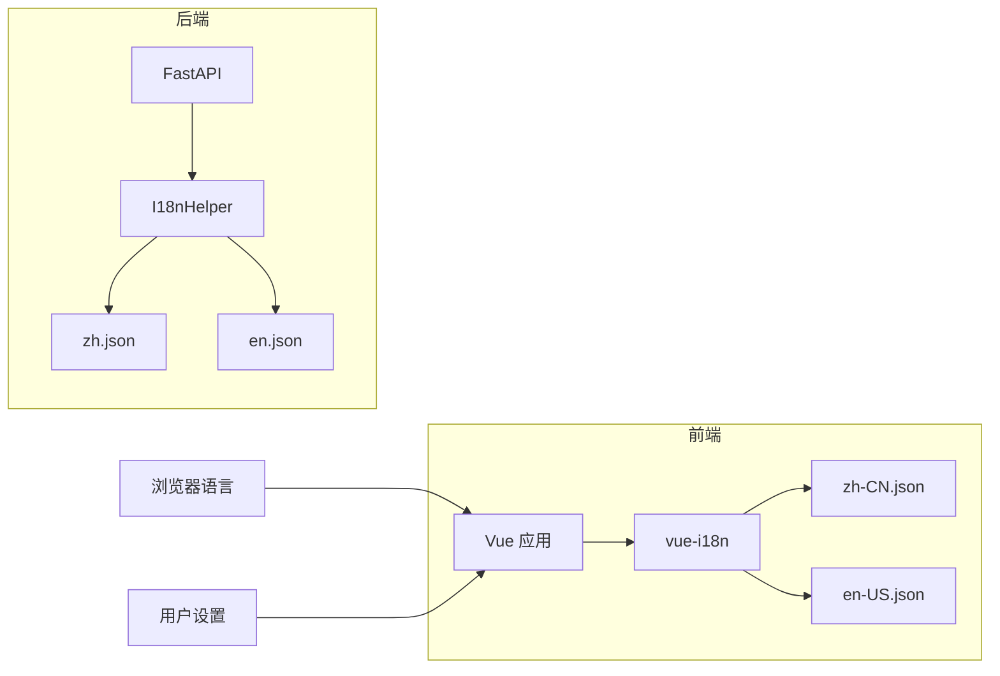

# 国际化 (i18n) 设计

## 1. 概述

SQLBot 支持多语言，目前已实现：
- 简体中文 (zh-CN)
- 英文 (en-US)

---

## 2. 架构设计



---

## 3. 前端国际化

### 3.1 目录结构

```
frontend/src/i18n/
├── index.ts          # i18n 配置
├── zh-CN.json        # 中文翻译
├── en-US.json        # 英文翻译
└── ...
```

### 3.2 配置文件

```typescript
// src/i18n/index.ts
import { createI18n } from 'vue-i18n'
import zhCN from './zh-CN.json'
import enUS from './en-US.json'

export const i18n = createI18n({
  legacy: false,
  locale: 'zh-CN',
  fallbackLocale: 'en-US',
  messages: {
    'zh-CN': zhCN,
    'en-US': enUS,
  }
})
```

### 3.3 翻译文件格式

```json
// zh-CN.json
{
  "common": {
    "confirm": "确认",
    "cancel": "取消",
    "save": "保存",
    "delete": "删除",
    "edit": "编辑",
    "search": "搜索"
  },
  "chat": {
    "newConversation": "新建对话",
    "inputPlaceholder": "请输入您的问题...",
    "generating": "正在生成..."
  },
  "datasource": {
    "title": "数据源管理",
    "create": "新建数据源",
    "testConnection": "测试连接"
  }
}
```

### 3.4 使用方式

#### 模板中使用

```vue
<template>
  <el-button>{{ $t('common.confirm') }}</el-button>
  <span>{{ $t('chat.newConversation') }}</span>
</template>
```

#### 组合式 API 中使用

```typescript
import { useI18n } from 'vue-i18n'

const { t, locale } = useI18n()

// 获取翻译
const text = t('common.confirm')

// 切换语言
locale.value = 'en-US'
```

#### 带参数的翻译

```json
// zh-CN.json
{
  "welcome": "欢迎，{name}！"
}
```

```typescript
t('welcome', { name: 'Admin' })  // "欢迎，Admin！"
```

---

## 4. 后端国际化

### 4.1 目录结构

```
backend/locales/
├── zh.json           # 中文
├── en.json           # 英文
└── ...
```

### 4.2 I18nHelper 类

```python
# common/utils/locale.py

class I18n:
    def __init__(self):
        self.translations = {}
        self._load_translations()
    
    def _load_translations(self):
        locales_dir = Path(__file__).parent.parent.parent / 'locales'
        for file in locales_dir.glob('*.json'):
            lang = file.stem
            with open(file, 'r', encoding='utf-8') as f:
                self.translations[lang] = json.load(f)
    
    def get(self, key: str, lang: str = 'zh') -> str:
        return self.translations.get(lang, {}).get(key, key)


class I18nHelper:
    def __init__(self, lang: str = 'zh'):
        self.lang = lang
        self.i18n = I18n()
    
    def t(self, key: str) -> str:
        return self.i18n.get(key, self.lang)
```

### 4.3 使用方式

```python
# 在 API 中使用
from common.utils.locale import I18nHelper

@router.get("/example")
def example_api(trans: I18nHelper = Depends(get_i18n)):
    message = trans.t("success_message")
    return {"message": message}
```

### 4.4 翻译文件

```json
// locales/zh.json
{
  "success_message": "操作成功",
  "error_not_found": "资源不存在",
  "error_unauthorized": "未授权访问",
  "error_invalid_params": "参数无效"
}

// locales/en.json
{
  "success_message": "Operation successful",
  "error_not_found": "Resource not found",
  "error_unauthorized": "Unauthorized access",
  "error_invalid_params": "Invalid parameters"
}
```

---

## 5. API 文档国际化

### 5.1 Swagger 文档多语言

```python
# main.py
@app.get("/docs", include_in_schema=False)
async def custom_swagger_ui(request: Request):
    lang = get_language_from_request(request)
    return get_swagger_ui_html(
        openapi_url=f"/openapi.json?lang={lang}",
        title="SQLBot API Docs",
    )
```

访问方式：
- 中文：`/docs?lang=zh`
- 英文：`/docs?lang=en`

---

## 6. 语言切换

### 6.1 前端切换

```typescript
// stores/user.ts
export const useUserStore = defineStore('user', () => {
  const language = ref(localStorage.getItem('language') || 'zh-CN')
  
  function setLanguage(lang: string) {
    language.value = lang
    localStorage.setItem('language', lang)
    i18n.global.locale.value = lang
    // 同步到后端
    updateUserLanguage(lang)
  }
  
  return { language, setLanguage }
})
```

### 6.2 用户偏好存储

用户语言偏好存储在 `sys_user.language` 字段：

| 值 | 语言 |
| :---: | :--- |
| 1 | 简体中文 |
| 2 | English |

---

## 7. 添加新语言

### 7.1 前端

1. 创建翻译文件：`src/i18n/ja-JP.json`
2. 注册语言：
```typescript
// src/i18n/index.ts
import jaJP from './ja-JP.json'

messages: {
  'zh-CN': zhCN,
  'en-US': enUS,
  'ja-JP': jaJP,  // 新增
}
```

### 7.2 后端

1. 创建翻译文件：`locales/ja.json`
2. 无需额外配置，I18nHelper 会自动加载

---

## 8. 最佳实践

### 8.1 翻译键命名规范

```
{模块}.{功能}.{描述}

示例：
chat.message.placeholder
datasource.form.hostLabel
common.button.submit
```

### 8.2 避免硬编码文本

```typescript
// ❌ 不推荐
<span>确认删除吗？</span>

// ✅ 推荐
<span>{{ $t('common.confirmDelete') }}</span>
```

### 8.3 日期时间格式化

```typescript
// 使用 dayjs 配合语言设置
import dayjs from 'dayjs'
import 'dayjs/locale/zh-cn'

dayjs.locale(locale.value === 'zh-CN' ? 'zh-cn' : 'en')
dayjs().format('YYYY年MM月DD日')  // 中文
dayjs().format('MMM DD, YYYY')    // 英文
```

### 8.4 数字格式化

```typescript
// 使用 Intl.NumberFormat
const formatter = new Intl.NumberFormat(locale.value, {
  style: 'currency',
  currency: locale.value === 'zh-CN' ? 'CNY' : 'USD'
})
formatter.format(1234.56)  // ¥1,234.56 / $1,234.56
```
