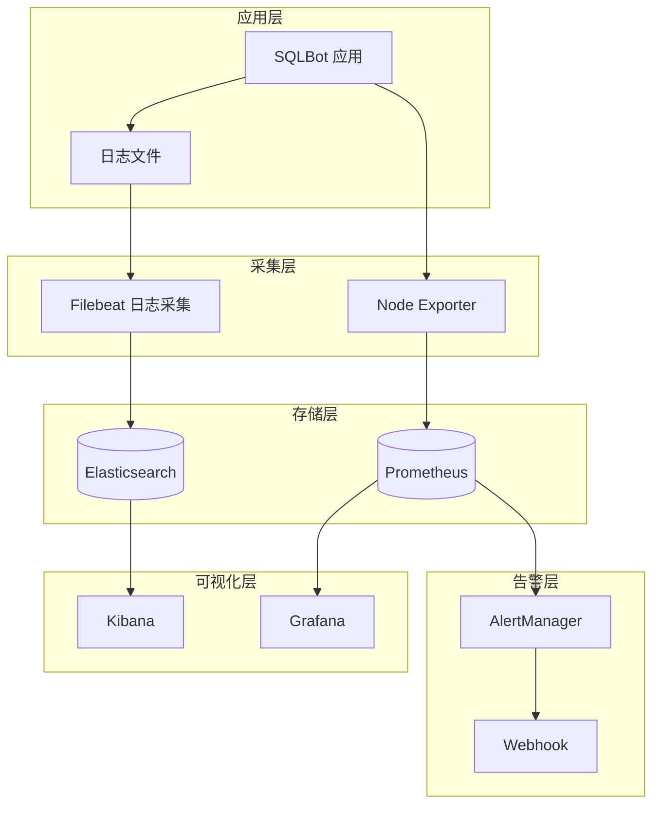

# 监控与告警

## 1. 监控架构



---

## 2. 日志监控

### 2.1 日志格式

```python
# common/core/config.py
LOG_FORMAT: str = "%(asctime)s - %(name)s - %(levelname)s:%(lineno)d - %(message)s"
```

示例日志：
```
2025-01-01 12:00:00,000 - sqlbot - INFO:42 - ✅ SQLBot 初始化完成
2025-01-01 12:01:00,000 - sqlbot - ERROR:156 - 数据库连接失败: connection refused
```

### 2.2 日志级别

| 级别 | 环境变量 | 说明 |
| :--- | :--- | :--- |
| DEBUG | `LOG_LEVEL=DEBUG` | 调试信息 |
| INFO | `LOG_LEVEL=INFO` | 常规操作 |
| WARNING | `LOG_LEVEL=WARNING` | 警告信息 |
| ERROR | `LOG_LEVEL=ERROR` | 错误信息 |

### 2.3 日志采集配置

```yaml
# filebeat.yml
filebeat.inputs:
  - type: log
    enabled: true
    paths:
      - /opt/sqlbot/app/logs/*.log
    multiline:
      pattern: '^\d{4}-\d{2}-\d{2}'
      negate: true
      match: after
    fields:
      app: sqlbot
      env: production

output.elasticsearch:
  hosts: ["elasticsearch:9200"]
  index: "sqlbot-logs-%{+yyyy.MM.dd}"
```

### 2.4 Kibana 仪表盘

建议创建以下视图：
- 错误日志趋势
- 请求量统计
- 响应时间分布
- 用户活跃度

---

## 3. 指标监控

### 3.1 应用指标

| 指标名称 | 类型 | 说明 |
| :--- | :--- | :--- |
| `sqlbot_requests_total` | Counter | 总请求数 |
| `sqlbot_request_duration_seconds` | Histogram | 请求耗时 |
| `sqlbot_active_connections` | Gauge | 活跃连接数 |
| `sqlbot_llm_tokens_total` | Counter | Token 使用量 |
| `sqlbot_sql_executions_total` | Counter | SQL 执行次数 |

### 3.2 Prometheus 配置

```yaml
# prometheus.yml
global:
  scrape_interval: 15s

scrape_configs:
  - job_name: 'sqlbot'
    static_configs:
      - targets: ['sqlbot:8000']
    metrics_path: /metrics

  - job_name: 'postgres'
    static_configs:
      - targets: ['postgres-exporter:9187']

  - job_name: 'node'
    static_configs:
      - targets: ['node-exporter:9100']
```

### 3.3 Grafana 仪表盘

#### 应用概览面板

```json
{
  "panels": [
    {
      "title": "请求量 (QPS)",
      "type": "graph",
      "targets": [
        {
          "expr": "rate(sqlbot_requests_total[5m])"
        }
      ]
    },
    {
      "title": "响应时间 (P99)",
      "type": "graph",
      "targets": [
        {
          "expr": "histogram_quantile(0.99, rate(sqlbot_request_duration_seconds_bucket[5m]))"
        }
      ]
    },
    {
      "title": "错误率",
      "type": "stat",
      "targets": [
        {
          "expr": "rate(sqlbot_requests_total{status='500'}[5m]) / rate(sqlbot_requests_total[5m])"
        }
      ]
    }
  ]
}
```

---

## 4. 健康检查

### 4.1 检查端点

```bash
# 应用健康检查
curl http://localhost:8000/api/v1/settings/basic

# 预期响应
{"code": 200, "data": {...}}
```

### 4.2 Docker 健康检查

```yaml
healthcheck:
  test: ["CMD", "curl", "-f", "http://localhost:8000/api/v1/settings/basic"]
  interval: 30s
  timeout: 10s
  retries: 3
  start_period: 60s
```

### 4.3 Kubernetes 探针

```yaml
livenessProbe:
  httpGet:
    path: /api/v1/settings/basic
    port: 8000
  initialDelaySeconds: 60
  periodSeconds: 30

readinessProbe:
  httpGet:
    path: /api/v1/settings/basic
    port: 8000
  initialDelaySeconds: 30
  periodSeconds: 10
```

---

## 5. 告警规则

### 5.1 应用告警

```yaml
# alertmanager/rules/sqlbot.yml
groups:
  - name: sqlbot
    rules:
      - alert: SQLBotDown
        expr: up{job="sqlbot"} == 0
        for: 1m
        labels:
          severity: critical
        annotations:
          summary: "SQLBot 服务不可用"
          description: "SQLBot 服务已停止超过 1 分钟"

      - alert: HighErrorRate
        expr: rate(sqlbot_requests_total{status="500"}[5m]) / rate(sqlbot_requests_total[5m]) > 0.05
        for: 5m
        labels:
          severity: warning
        annotations:
          summary: "错误率过高"
          description: "5 分钟内错误率超过 5%"

      - alert: SlowResponse
        expr: histogram_quantile(0.99, rate(sqlbot_request_duration_seconds_bucket[5m])) > 10
        for: 5m
        labels:
          severity: warning
        annotations:
          summary: "响应缓慢"
          description: "P99 响应时间超过 10 秒"
```

### 5.2 资源告警

```yaml
groups:
  - name: resources
    rules:
      - alert: HighCPUUsage
        expr: (1 - avg(rate(node_cpu_seconds_total{mode="idle"}[5m]))) * 100 > 80
        for: 10m
        labels:
          severity: warning
        annotations:
          summary: "CPU 使用率过高"

      - alert: HighMemoryUsage
        expr: (1 - node_memory_MemAvailable_bytes / node_memory_MemTotal_bytes) * 100 > 85
        for: 10m
        labels:
          severity: warning
        annotations:
          summary: "内存使用率过高"

      - alert: DiskSpaceLow
        expr: (1 - node_filesystem_avail_bytes / node_filesystem_size_bytes) * 100 > 85
        for: 10m
        labels:
          severity: warning
        annotations:
          summary: "磁盘空间不足"
```

### 5.3 数据库告警

```yaml
groups:
  - name: postgres
    rules:
      - alert: PostgresDown
        expr: pg_up == 0
        for: 1m
        labels:
          severity: critical

      - alert: TooManyConnections
        expr: pg_stat_activity_count / pg_settings_max_connections > 0.8
        for: 5m
        labels:
          severity: warning
```

---

## 6. 告警通知

### 6.1 AlertManager 配置

```yaml
# alertmanager.yml
global:
  resolve_timeout: 5m

route:
  group_by: ['alertname']
  group_wait: 10s
  group_interval: 10s
  repeat_interval: 1h
  receiver: 'default'
  routes:
    - match:
        severity: critical
      receiver: 'critical'

receivers:
  - name: 'default'
    webhook_configs:
      - url: 'http://webhook-server/alert'

  - name: 'critical'
    webhook_configs:
      - url: 'http://webhook-server/critical'
    email_configs:
      - to: 'ops@example.com'
```

### 6.2 钉钉/飞书告警

```python
# webhook 处理
def send_dingtalk_alert(alert):
    webhook_url = "https://oapi.dingtalk.com/robot/send?access_token=xxx"
    
    message = {
        "msgtype": "markdown",
        "markdown": {
            "title": f"[{alert['status']}] {alert['alertname']}",
            "text": f"""
### 告警通知
- **告警名称**: {alert['alertname']}
- **严重程度**: {alert['severity']}
- **描述**: {alert['description']}
- **时间**: {alert['startsAt']}
            """
        }
    }
    
    requests.post(webhook_url, json=message)
```

---

## 7. 监控检查清单

- [ ] 日志采集已配置
- [ ] Prometheus 已部署
- [ ] Grafana 仪表盘已创建
- [ ] 健康检查已配置
- [ ] 告警规则已定义
- [ ] 告警通知已配置
- [ ] 定期检查告警有效性
