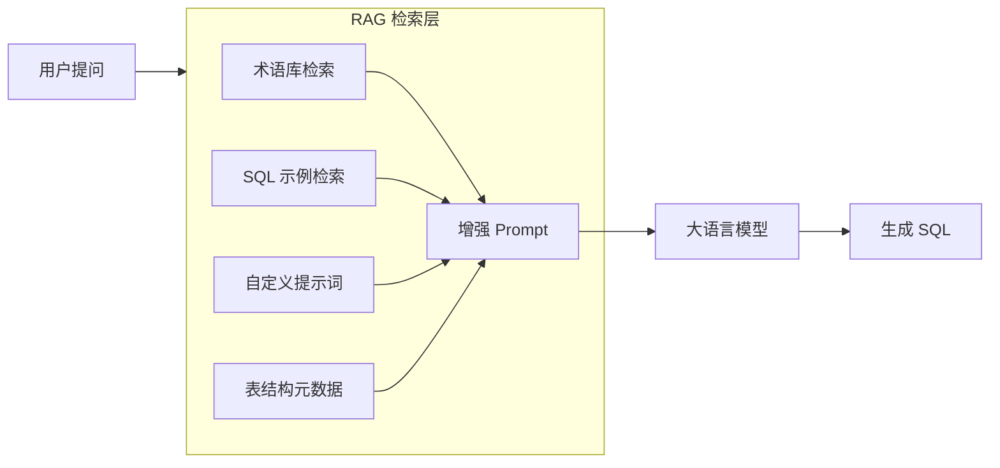
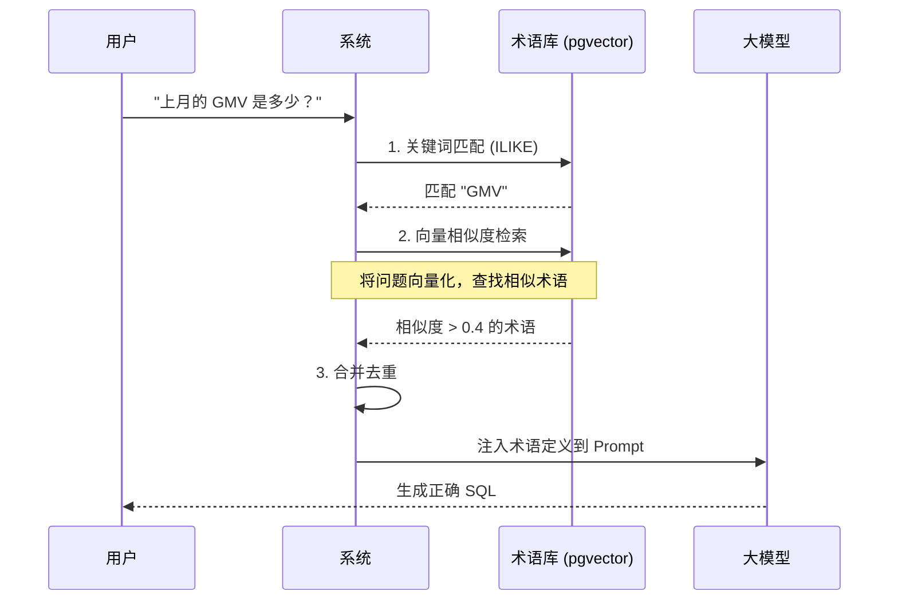
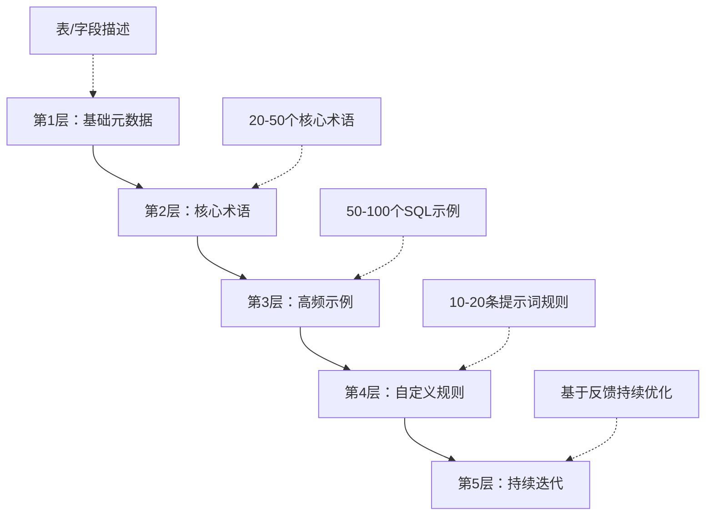
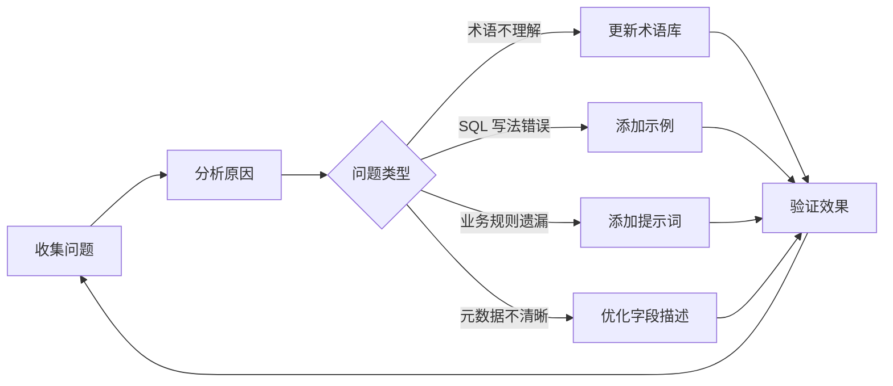

# SQLBot 专业领域 AI 问答准确度提升指南

> 本指南详细介绍如何通过 SQLBot 提供的各项配置功能，提升 AI 在专业领域（如金融、医疗、制造等）的自然语言问答准确度。

---

## 目录

1. [准确度影响因素分析](#1-准确度影响因素分析)
2. [术语配置（Terminology）](#2-术语配置terminology)
3. [SQL 示例库（SQL Sample Library）](#3-sql-示例库sql-sample-library)
4. [自定义提示词（Custom Prompt）](#4-自定义提示词custom-prompt)
5. [数据源元数据优化](#5-数据源元数据优化)
6. [表关系配置](#6-表关系配置)
7. [综合优化策略](#7-综合优化策略)
8. [效果评估与迭代](#8-效果评估与迭代)

---

## 1. 准确度影响因素分析

### 1.1 AI 生成 SQL 的挑战

在专业领域使用自然语言生成 SQL 时，常见的准确度问题包括：

| 问题类型 | 示例 | 根本原因 |
| :--- | :--- | :--- |
| **术语理解偏差** | "GMV" 被理解为字面意思 | LLM 缺乏领域专业知识 |
| **表/字段选择错误** | 查询销售额却选了订单数量字段 | 字段描述不清晰 |
| **SQL 语法不适配** | 日期函数在 MySQL 和 PostgreSQL 中不同 | 缺乏数据库特定规则 |
| **业务逻辑遗漏** | 忘记排除已取消订单 | 缺少业务规则指导 |
| **表关联错误** | 多表 JOIN 时关联字段选错 | 缺少表关系知识 |

### 1.2 SQLBot 的解决方案架构



**核心原理**：通过 RAG（检索增强生成）将专业领域知识动态注入 Prompt，让 LLM 在生成 SQL 时具备领域上下文。

---

## 2. 术语配置（Terminology）

### 2.1 功能说明

术语配置用于定义专业领域的业务术语及其含义。当用户提问中包含这些术语时，系统会自动将术语定义注入 Prompt，帮助 LLM 正确理解用户意图。

**前端入口**：`系统管理` → `术语配置`

### 2.2 术语的数据结构

| 字段 | 说明 | 示例 |
| :--- | :--- | :--- |
| **术语名称** | 主术语 | GMV |
| **同义词** | 术语的其他叫法 | 总成交额、成交总额 |
| **术语描述** | 详细定义和计算方式 | 指在统计周期内，所有已付款订单的金额总和，不包含退款订单 |
| **生效数据源** | 适用的数据源范围 | 全部数据源 / 指定数据源 |
| **启用状态** | 是否在问答中生效 | 启用 / 禁用 |

### 2.3 配置最佳实践

#### 2.3.1 术语描述要精确

```
❌ 错误示例：
术语：GMV
描述：销售额

✅ 正确示例：
术语：GMV
描述：GMV（Gross Merchandise Volume）= SUM(order_amount)，
     计算条件：
     - 订单状态 = '已完成'（order_status = 'completed'）
     - 不包含退款订单（refund_status != 'refunded'）
     - 统计周期内的 order_time
```

#### 2.3.2 包含字段映射

在描述中明确指出对应的表名和字段名：

```
术语：日活用户
同义词：DAU、日活
描述：日活跃用户数 = COUNT(DISTINCT user_id)
     数据来源：user_login_log 表
     计算条件：login_time 在目标日期当天
     去重字段：user_id
```

#### 2.3.3 按数据源分离

不同业务线可能对同一术语有不同定义：

```yaml
# 电商数据源
术语: 订单金额
生效数据源: 电商数据库
描述: SUM(orders.order_amount)，包含所有已支付订单

# 财务数据源  
术语: 订单金额
生效数据源: 财务数据库
描述: SUM(finance_orders.confirmed_amount)，仅包含财务确认的订单
```

### 2.4 术语检索原理



### 2.5 批量导入

支持通过 Excel 批量导入术语：

1. 点击「导入」按钮下载模板
2. 按模板格式填写术语数据
3. 上传 Excel 文件

**模板格式**：

| 术语名称 | 同义词(逗号分隔) | 术语描述 | 数据源名称 |
| :--- | :--- | :--- | :--- |
| GMV | 总成交额,成交总额 | SUM(order_amount)... | 电商数据库 |

---

## 3. SQL 示例库（SQL Sample Library）

### 3.1 功能说明

SQL 示例库通过「问题 → SQL」的示例对，让 LLM 学习特定业务场景的 SQL 写法。这是提升准确度最直接有效的方式。

**前端入口**：`系统管理` → `SQL 示例库`

### 3.2 示例的数据结构

| 字段 | 说明 | 示例 |
| :--- | :--- | :--- |
| **问题描述** | 自然语言问题 | 查询本月销售额前10的商品 |
| **示例 SQL** | 对应的标准 SQL | `SELECT product_name, SUM(amount) ...` |
| **数据源** | 关联的数据源 | 销售数据库 |
| **高级应用** | 关联的助手类型 | （可选） |
| **启用状态** | 是否生效 | 启用 / 禁用 |

### 3.3 配置最佳实践

#### 3.3.1 覆盖高频业务场景

优先收集实际使用中的高频问题：

```yaml
# 示例 1：时间范围查询
问题: 最近7天的订单数量
SQL: |
  SELECT DATE(order_time) as order_date, 
         COUNT(*) as order_count
  FROM orders
  WHERE order_time >= CURRENT_DATE - INTERVAL '7 days'
  GROUP BY DATE(order_time)
  ORDER BY order_date DESC

# 示例 2：Top N 查询
问题: 销售额前10的客户
SQL: |
  SELECT customer_name, 
         SUM(order_amount) as total_amount
  FROM customers c
  JOIN orders o ON c.id = o.customer_id
  WHERE o.order_status = 'completed'
  GROUP BY customer_name
  ORDER BY total_amount DESC
  LIMIT 10

# 示例 3：同比/环比
问题: 本月销售额同比增长率
SQL: |
  WITH current_month AS (
    SELECT SUM(amount) as current_amount
    FROM sales
    WHERE sale_date >= DATE_TRUNC('month', CURRENT_DATE)
  ),
  last_year_month AS (
    SELECT SUM(amount) as last_year_amount
    FROM sales
    WHERE sale_date >= DATE_TRUNC('month', CURRENT_DATE - INTERVAL '1 year')
      AND sale_date < DATE_TRUNC('month', CURRENT_DATE - INTERVAL '1 year') 
                      + INTERVAL '1 month'
  )
  SELECT 
    current_amount,
    last_year_amount,
    ROUND((current_amount - last_year_amount) / last_year_amount * 100, 2) 
      as yoy_growth_rate
  FROM current_month, last_year_month
```

#### 3.3.2 包含业务过滤条件

示例中应体现业务规则：

```sql
-- 问题：有效订单的总金额
-- 示例 SQL 中包含业务过滤逻辑
SELECT SUM(order_amount) as total_amount
FROM orders
WHERE order_status IN ('paid', 'shipped', 'completed')  -- 有效状态
  AND is_deleted = false                                 -- 未删除
  AND order_amount > 0                                   -- 金额有效
```

#### 3.3.3 使用标准格式

保持 SQL 格式一致，便于 LLM 学习：

```sql
-- 推荐格式
SELECT 
    column1,
    column2,
    SUM(column3) AS total_column3
FROM table_name t1
LEFT JOIN other_table t2 ON t1.id = t2.fk_id
WHERE t1.status = 'active'
GROUP BY column1, column2
ORDER BY total_column3 DESC
LIMIT 100
```

### 3.4 示例检索原理

系统使用两种方式检索相关示例：

1. **关键词匹配**：问题文本的模糊匹配
2. **语义相似度**：基于 Embedding 的向量检索

```sql
-- 向量相似度检索 SQL
SELECT id, question, description
FROM data_training
WHERE (1 - (embedding <=> :question_embedding)) > 0.4  -- 相似度阈值
  AND datasource = :datasource_id
  AND enabled = true
ORDER BY similarity DESC
LIMIT 10  -- 取 Top 10
```

---

## 4. 自定义提示词（Custom Prompt）

### 4.1 功能说明

自定义提示词允许针对特定场景添加额外的指导规则，直接注入到 LLM 的 System Prompt 中。

**前端入口**：`系统管理` → `自定义提示词`

支持三种类型：
- **问 SQL**：SQL 生成场景
- **数据分析**：数据分析场景
- **数据预测**：数据预测场景

### 4.2 配置最佳实践

#### 4.2.1 数据库特定规则

```
提示词名称: PostgreSQL 日期处理规则
类型: 问 SQL
生效数据源: PostgreSQL 数据库

提示词内容:
在生成 SQL 时，请遵循以下 PostgreSQL 日期处理规则：
1. 获取当前日期使用 CURRENT_DATE，不要使用 NOW()::date
2. 日期截断使用 DATE_TRUNC('month', column)，不要使用 EXTRACT
3. 日期间隔使用 INTERVAL '7 days'，不要使用 DATEADD
4. 日期格式化使用 TO_CHAR(date, 'YYYY-MM-DD')
```

#### 4.2.2 业务规则约束

```
提示词名称: 订单数据过滤规则
类型: 问 SQL
生效数据源: 电商数据库

提示词内容:
查询订单相关数据时，请自动应用以下过滤条件：
1. 排除测试订单：is_test = false
2. 排除内部订单：order_source != 'internal'
3. 默认只查询近1年的数据
4. 金额计算时需排除已全额退款的订单
```

#### 4.2.3 命名规范指导

```
提示词名称: 字段命名规范
类型: 问 SQL
生效数据源: 全部数据源

提示词内容:
生成 SQL 时请遵循以下命名规范：
1. 表别名使用表名首字母（如 orders → o, customers → c）
2. 计算字段使用中文别名或业务含义别名
3. 聚合函数结果使用 total_xxx, avg_xxx, count_xxx 格式
4. 日期字段使用 xxx_date 或 xxx_time 后缀
```

### 4.3 提示词注入位置

自定义提示词被注入到 System Prompt 的 `{custom_prompt}` 占位符位置：

```
你是一个专业的 SQL 生成助手。

## 数据库信息
- 引擎类型: {engine}
- 表结构: {schema}

## 术语定义
{terminologies}

## 参考示例
{data_training}

## 自定义提示词    <-- 注入位置
{custom_prompt}

## 输出要求
...
```

---

## 5. 数据源元数据优化

### 5.1 功能说明

数据源的元数据是 LLM 理解数据结构的基础。优化元数据描述可以显著提升 SQL 生成的准确度。

**前端入口**：`数据中心` → 选择数据源 → `数据表管理`

### 5.2 表级描述

为每个数据表添加清晰的业务描述：

| 表名 | 描述示例 |
| :--- | :--- |
| `orders` | 订单主表，存储订单基本信息。每条记录代表一笔订单，包含订单金额、状态、创建时间等。 |
| `order_items` | 订单明细表，与 orders 是一对多关系。存储订单中的每个商品项。 |
| `customers` | 客户信息表，存储客户基本资料，与 orders 通过 customer_id 关联。 |

### 5.3 字段级描述

为关键字段添加详细描述：

| 字段名 | 字段描述示例 |
| :--- | :--- |
| `order_status` | 订单状态：pending(待支付), paid(已支付), shipped(已发货), completed(已完成), cancelled(已取消), refunded(已退款) |
| `order_amount` | 订单金额（元），包含商品金额，不包含运费。精度：小数点后两位。 |
| `created_at` | 订单创建时间，UTC 时区，格式：YYYY-MM-DD HH:MM:SS |

### 5.4 字段描述的关键要素

优质的字段描述应包含：

1. **业务含义**：这个字段代表什么业务概念
2. **取值范围**：枚举值、数值范围、格式说明
3. **单位信息**：金额单位、时间格式、百分比等
4. **计算逻辑**：如果是计算字段，说明计算方式
5. **关联关系**：与其他表/字段的关联

```yaml
# 字段描述模板
字段名: monthly_revenue
描述: |
  月度营收金额
  - 单位：元（人民币）
  - 计算方式：当月所有已完成订单的 order_amount 之和
  - 精度：小数点后2位
  - 更新频率：每日凌晨更新
  - 关联：由 orders 表按月聚合计算得出
```

---

## 6. 表关系配置

### 6.1 功能说明

配置表之间的关联关系，帮助 LLM 正确生成多表 JOIN 查询。

**前端入口**：`数据中心` → 选择数据源 → `数据表管理` → `关系管理`

### 6.2 关系配置要素

| 要素 | 说明 | 示例 |
| :--- | :--- | :--- |
| 主表 | 关系的主体表 | orders |
| 关联表 | 需要 JOIN 的表 | customers |
| 主表字段 | 主表的关联键 | customer_id |
| 关联表字段 | 关联表的主键 | id |
| 关系类型 | 关联类型 | LEFT JOIN |

### 6.3 配置最佳实践

#### 6.3.1 明确主外键关系

```yaml
# 订单-客户关系
主表: orders
关联表: customers
关联条件: orders.customer_id = customers.id
关系类型: LEFT JOIN  # 有些订单可能没有客户信息

# 订单-订单明细关系  
主表: orders
关联表: order_items
关联条件: orders.id = order_items.order_id
关系类型: INNER JOIN  # 订单必须有明细
```

#### 6.3.2 处理复杂关联

对于复杂的多字段关联，在字段描述中说明：

```
表: daily_sales_summary
字段: product_id, sale_date

关联说明:
与 products 表通过 product_id 关联
与 calendar 表通过 sale_date = calendar.date 关联
```

---

## 7. 综合优化策略

### 7.1 分层优化方法

按照投入产出比，建议按以下顺序优化：



### 7.2 优化检查清单

#### 7.2.1 元数据完整性

- [ ] 所有核心业务表有清晰描述
- [ ] 关键字段（金额、状态、时间）有详细说明
- [ ] 枚举字段列出所有取值及含义
- [ ] 表关系正确配置

#### 7.2.2 术语库覆盖度

- [ ] 行业专有名词已定义（如 GMV、DAU、ARPU）
- [ ] 公司内部简称已定义（如 P0 客户、A 类商品）
- [ ] 常用缩写已定义
- [ ] 术语描述包含计算逻辑和字段映射

#### 7.2.3 SQL 示例质量

- [ ] 覆盖 TOP 20 高频问题场景
- [ ] 覆盖常见查询模式（TopN、同比、环比、占比等）
- [ ] 示例 SQL 遵循数据库语法规范
- [ ] 示例 SQL 包含必要的业务过滤条件

#### 7.2.4 自定义规则完备性

- [ ] 数据库特定语法规则已配置
- [ ] 通用业务过滤规则已配置
- [ ] 数据权限规则已配置

### 7.3 典型场景优化方案

#### 场景 1：金融领域

```yaml
术语配置:
  - AUM: 资产管理规模，SUM(account_balance)，只计算活跃账户
  - ROI: 投资回报率，(收益 - 成本) / 成本 * 100%
  - 净值: 基金单位净值，fund_nav 表的 nav 字段

自定义提示词:
  - 金额计算默认保留2位小数
  - 收益率计算默认保留4位小数
  - 日期默认使用交易日历（排除节假日）
  - 查询客户数据时需校验客户状态为有效
```

#### 场景 2：电商领域

```yaml
术语配置:
  - 下单转化率: 下单用户数 / 访问用户数 * 100%
  - 客单价: 订单总金额 / 订单数量
  - 复购率: 多次购买用户数 / 总购买用户数 * 100%

SQL示例:
  - 问题: "各渠道的转化率"
    SQL: |
      SELECT 
        channel,
        COUNT(DISTINCT visitor_id) as visitors,
        COUNT(DISTINCT order_id) as orders,
        ROUND(COUNT(DISTINCT order_id) * 100.0 / 
              NULLIF(COUNT(DISTINCT visitor_id), 0), 2) as conversion_rate
      FROM user_behavior
      GROUP BY channel
      ORDER BY conversion_rate DESC
```

#### 场景 3：制造领域

```yaml
术语配置:
  - OEE: 设备综合效率 = 可用率 × 性能率 × 良品率
  - 良品率: 合格产品数 / 总产出数 * 100%
  - 产能利用率: 实际产量 / 理论产能 * 100%

自定义提示词:
  - 时间统计默认按班次划分（早班 8-16，中班 16-24，夜班 0-8）
  - 产量统计需排除返工件
  - 设备查询需关联设备主数据获取设备名称
```

---

## 8. 效果评估与迭代

### 8.1 建立评估指标

| 指标 | 计算方式 | 目标值 |
| :--- | :--- | :--- |
| **SQL 生成成功率** | 成功执行的 SQL 数 / 总查询数 | > 90% |
| **首次正确率** | 首次生成即正确的查询数 / 总查询数 | > 70% |
| **重试率** | 需要重新生成的查询数 / 总查询数 | < 30% |
| **用户满意度** | 用户反馈为正面的比例 | > 80% |

### 8.2 收集问题反馈

建立问题收集机制：

1. **失败查询记录**：记录生成失败或执行失败的查询
2. **用户纠正日志**：记录用户修改 SQL 的情况
3. **高频问题统计**：分析用户最常问的问题类型

### 8.3 迭代优化流程



### 8.4 版本管理

建议对知识库进行版本管理：

1. 定期导出术语、示例、提示词配置
2. 记录每次变更的内容和原因
3. 评估变更前后的准确度差异

---

## 附录 A：快速入门检查清单

### 新数据源接入时

- [ ] 同步数据表结构
- [ ] 添加表级业务描述
- [ ] 添加关键字段描述（尤其是状态字段）
- [ ] 配置表关联关系
- [ ] 添加 10-20 个核心术语
- [ ] 添加 20-30 个高频问题的 SQL 示例
- [ ] 配置数据库特定语法规则

### 日常维护时

- [ ] 每周分析失败查询，补充对应的术语或示例
- [ ] 新业务上线时同步更新知识库
- [ ] 定期审核术语和示例的有效性

---

## 附录 B：配置示例模板

### 术语配置模板

```
术语名称: [术语]
同义词: [同义词1, 同义词2]
描述:
  业务定义：[业务含义描述]
  计算方式：[SQL 表达式或计算逻辑]
  数据来源：[对应的表.字段]
  注意事项：[特殊过滤条件或业务规则]
生效数据源: [全部 / 指定数据源名称]
```

### SQL 示例模板

```
问题描述: [自然语言问题]

示例 SQL:
SELECT 
    [字段列表]
FROM [主表]
[JOIN 关联表]
WHERE [过滤条件]
GROUP BY [分组字段]
ORDER BY [排序字段]
LIMIT [数量限制]

关联数据源: [数据源名称]
```

### 自定义提示词模板

```
提示词名称: [规则名称]
类型: 问 SQL / 数据分析 / 数据预测
生效数据源: 全部 / [数据源名称]

提示词内容:
在生成 [SQL/分析/预测] 时，请遵循以下规则：
1. [规则1]
2. [规则2]
3. [规则3]
```
