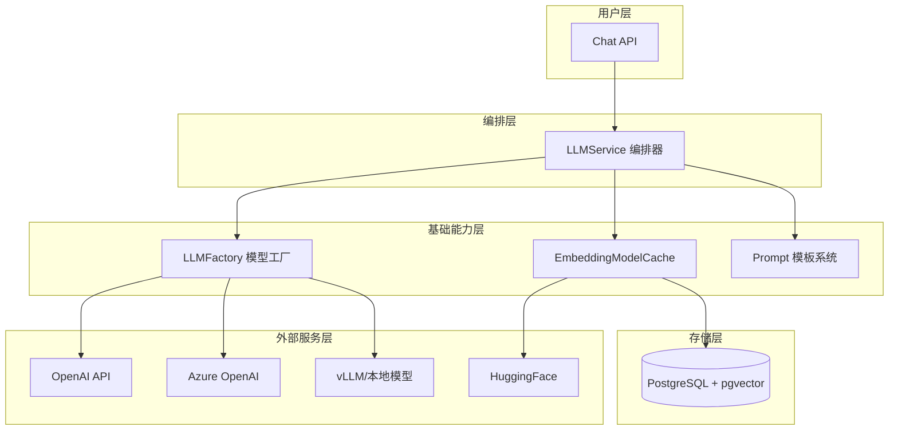
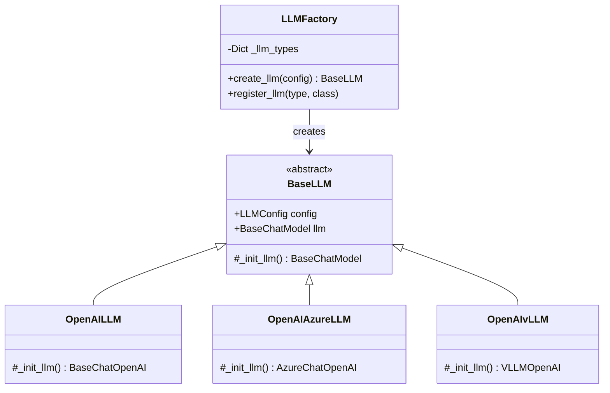
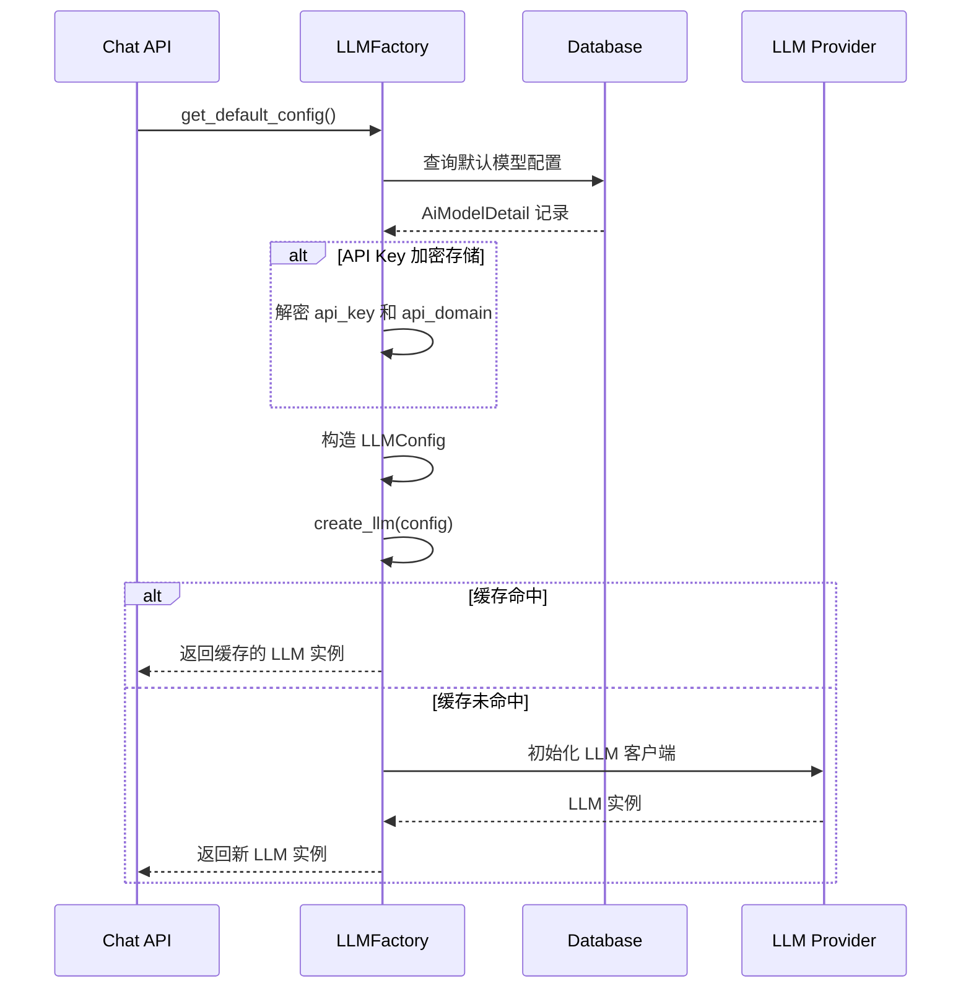
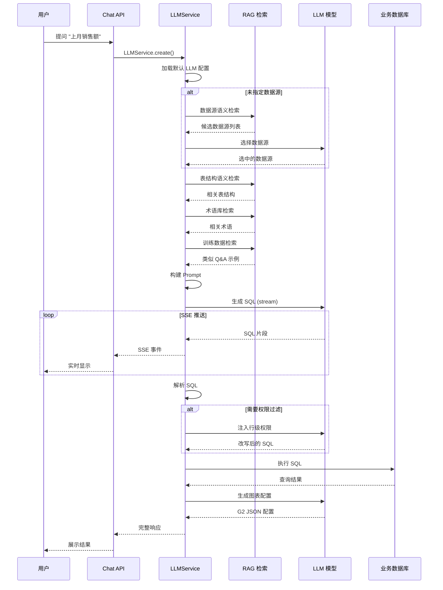

# SQLBot AI 架构与实现详解

> 本文档深度剖析 SQLBot 项目中所有 AI 相关的设计与实现，包含源码分析、设计决策、数据流和扩展指南。

---

## 1. 架构总览

### 1.1 核心设计理念

SQLBot 采用 **"服务编排式"** AI 架构，而非 Agent 自主决策模式：

| 维度 | Agent 模式 | SQLBot 模式 |
| :--- | :--- | :--- |
| **决策方式** | LLM 自主决策执行流程 | 代码控制固定流程，LLM 仅生成内容 |
| **确定性** | 低（每次运行可能不同） | 高（流程固定，仅输出变化） |
| **调试难度** | 高（需追踪思维链） | 低（明确的函数调用栈） |
| **SQL 安全** | 难以保证 | 可精确检查和过滤每条 SQL |
| **适用场景** | 复杂多步推理任务 | 确定性高的业务流程 |

**设计决策**：对于 Text-to-SQL 场景，**确定性和安全性**优先于灵活性，因此选择服务编排模式。

### 1.2 架构层次



---

## 2. 大语言模型层

### 2.1 LLMConfig 配置模型

**文件位置**：`backend/apps/ai_model/model_factory.py`

```python
class LLMConfig(BaseModel):
    """LLM 配置类"""
    model_id: Optional[int] = None      # 数据库中模型 ID
    model_type: str                      # 模型类型: openai/azure/vllm
    model_name: str                      # 具体模型名称: gpt-4/deepseek-chat
    api_key: Optional[str] = None        # API 密钥
    api_base_url: Optional[str] = None   # API 端点
    additional_params: Dict[str, Any] = {}  # 额外参数: temperature 等
    
    class Config:
        frozen = True  # 不可变，便于 LRU 缓存
```

**设计要点**：
- `frozen = True`：使配置对象可哈希，支持 `lru_cache` 缓存 LLM 实例
- `additional_params`：支持透传任意模型参数（如 `temperature`、`top_p`、`extra_body`）

### 2.2 LLMFactory 工厂模式

```python
class LLMFactory:
    """大模型工厂类"""
    
    _llm_types: Dict[str, Type[BaseLLM]] = {
        "openai": OpenAILLM,      # OpenAI 兼容 API
        "tongyi": OpenAILLM,      # 通义千问（OpenAI 兼容）
        "vllm": OpenAIvLLM,       # vLLM 本地部署
        "azure": OpenAIAzureLLM,  # Azure OpenAI
    }

    @classmethod
    @lru_cache(maxsize=32)  # 缓存最多 32 个 LLM 实例
    def create_llm(cls, config: LLMConfig) -> BaseLLM:
        llm_class = cls._llm_types.get(config.model_type)
        if not llm_class:
            raise ValueError(f"Unsupported LLM type: {config.model_type}")
        return llm_class(config)

    @classmethod
    def register_llm(cls, model_type: str, llm_class: Type[BaseLLM]):
        """注册新模型类型（扩展点）"""
        cls._llm_types[model_type] = llm_class
```

**架构图**：



### 2.3 自定义 BaseChatOpenAI

**文件位置**：`backend/apps/ai_model/openai/llm.py`

这是 SQLBot 对 LangChain `ChatOpenAI` 的核心扩展：

```python
class BaseChatOpenAI(ChatOpenAI):
    usage_metadata: dict = {}

    def _stream(self, *args, **kwargs) -> Iterator[ChatGenerationChunk]:
        kwargs['stream_usage'] = True  # 强制开启 usage 统计
        for chunk in super()._stream(*args, **kwargs):
            if chunk.message.usage_metadata is not None:
                self.usage_metadata = chunk.message.usage_metadata
            yield chunk

    def _convert_chunk_to_generation_chunk(self, chunk, ...):
        # 关键扩展：提取 reasoning_content（DeepSeek R1 等模型的思考过程）
        if 'reasoning_content' in _dict:
            additional_kwargs['reasoning_content'] = _dict.get('reasoning_content')
        # ... 其他处理
```

**扩展点说明**：

| 扩展 | 目的 |
| :--- | :--- |
| `stream_usage=True` | 强制开启流式 Token 统计 |
| `reasoning_content` 提取 | 支持 DeepSeek R1 等模型的"思考过程"展示 |
| `usage_metadata` 保存 | 记录每次调用的 Token 消耗 |

### 2.4 模型配置加载流程



---

## 3. Embedding 向量化层

### 3.1 EmbeddingModelCache 缓存机制

**文件位置**：`backend/apps/ai_model/embedding.py`

```python
class EmbeddingModelInfo(BaseModel):
    folder: str       # 模型存储目录
    name: str         # 模型名称/路径
    device: str = 'cpu'  # 运行设备

# 智能模型路径检测
_local_path = os.path.join(settings.LOCAL_MODEL_PATH, 'embedding', 
                           "shibing624_text2vec-base-chinese")
_model_name = _local_path if os.path.exists(_local_path) else settings.DEFAULT_EMBEDDING_MODEL

local_embedding_model = EmbeddingModelInfo(
    folder=settings.LOCAL_MODEL_PATH,
    name=_model_name  # 优先本地，否则自动下载
)


class EmbeddingModelCache:
    @staticmethod
    def get_model(key: str = settings.DEFAULT_EMBEDDING_MODEL,
                  config: EmbeddingModelInfo = local_embedding_model) -> Embeddings:
        """线程安全的单例获取"""
        model_instance = _embedding_model.get(key)
        if model_instance is None:
            lock = EmbeddingModelCache._get_lock(key)
            with lock:  # 双重检查锁
                model_instance = _embedding_model.get(key)
                if model_instance is None:
                    model_instance = EmbeddingModelCache._new_instance(config)
                    _embedding_model[key] = model_instance
        return model_instance
```

**设计要点**：
1. **双重检查锁**：确保多线程环境下只初始化一次
2. **智能路径检测**：优先使用本地模型，不存在时自动从 HuggingFace 下载
3. **全局单例**：避免重复加载大型模型

### 3.2 默认 Embedding 模型

| 配置项 | 值 | 说明 |
| :--- | :--- | :--- |
| 模型 | `shibing624/text2vec-base-chinese` | 中文语义相似度模型 |
| 维度 | 768 | 向量维度 |
| 归一化 | `normalize_embeddings=True` | 输出单位向量 |

---

## 4. RAG 检索增强层

### 4.1 向量存储（pgvector）

SQLBot 使用 PostgreSQL 的 `pgvector` 扩展存储三类向量：

| 表名 | 用途 | 向量字段 |
| :--- | :--- | :--- |
| `core_table` | 表结构描述向量 | `embedding` |
| `terminology` | 术语库向量 | `embedding` |
| `core_datasource` | 数据源描述向量 | `embedding` |

**pgvector 操作示例**（`terminology.py`）：

```sql
-- 相似度查询（余弦距离）
SELECT id, pid, word, 
       (1 - (embedding <=> :embedding_array)) AS similarity
FROM terminology
WHERE similarity > 0.6 
  AND oid = :oid 
  AND enabled = true
ORDER BY similarity DESC
LIMIT 10
```

### 4.2 表结构语义检索

**文件位置**：`backend/apps/datasource/embedding/table_embedding.py`

```python
def calc_table_embedding(tables: list[dict], question: str):
    """基于预存向量的表结构检索"""
    model = EmbeddingModelCache.get_model()
    
    # 1. 问题向量化
    q_embedding = model.embed_query(question)
    
    # 2. 计算与每个表的相似度
    for index, table in enumerate(tables):
        embedding = json.loads(table.get('embedding'))
        tables[index]['cosine_similarity'] = cosine_similarity(q_embedding, embedding)
    
    # 3. 按相似度排序，取 Top N
    tables.sort(key=lambda x: x['cosine_similarity'], reverse=True)
    return tables[:settings.TABLE_EMBEDDING_COUNT]
```

### 4.3 数据源语义检索

**文件位置**：`backend/apps/datasource/embedding/ds_embedding.py`

当用户未指定数据源时，系统会：
1. 对问题进行向量化
2. 与所有数据源的描述向量计算相似度
3. 返回最匹配的数据源列表供 LLM 选择

```python
def get_ds_embedding(session, current_user, _ds_list, out_ds, question, ...):
    """数据源语义检索"""
    model = EmbeddingModelCache.get_model()
    q_embedding = model.embed_query(question)
    
    for ds in _ds_list:
        embedding = json.loads(ds.get('embedding'))
        ds['cosine_similarity'] = cosine_similarity(q_embedding, embedding)
    
    _list.sort(key=lambda x: x['cosine_similarity'], reverse=True)
    return _list[:settings.DS_EMBEDDING_COUNT]
```

### 4.4 术语库语义检索

**文件位置**：`backend/apps/terminology/curd/terminology.py`

```python
def select_terminology_by_word(session, word: str, oid: int, datasource: int = None):
    """术语检索（关键词 + 语义）"""
    
    # 1. 精确匹配（SQL ILIKE）
    stmt = select(Terminology.id, Terminology.pid, Terminology.word) \
           .where(text(":sentence ILIKE '%' || word || '%'"))
    
    # 2. 语义匹配（向量相似度）
    if settings.EMBEDDING_ENABLED:
        model = EmbeddingModelCache.get_model()
        embedding = model.embed_query(word)
        
        results = session.execute(text(embedding_sql), {
            'embedding_array': str(embedding),
            'oid': oid
        })
```

---

## 5. LLMService 编排层

### 5.1 核心类结构

**文件位置**：`backend/apps/chat/task/llm.py`

```python
class LLMService:
    """核心编排服务"""
    
    # 上下文数据
    ds: CoreDatasource                    # 当前数据源
    chat_question: ChatQuestion           # 问题对象
    record: ChatRecord                    # 对话记录
    config: LLMConfig                     # LLM 配置
    llm: BaseChatModel                    # LLM 实例
    
    # 消息历史
    sql_message: List[BaseMessage] = []   # SQL 生成对话历史
    chart_message: List[BaseMessage] = [] # 图表生成对话历史
    
    # 用户信息
    current_user: CurrentUser
    current_assistant: Optional[CurrentAssistant]
```

### 5.2 主流程时序图



### 5.3 核心方法详解

#### 5.3.1 run_task() - 主入口

```python
def run_task(self, in_chat: bool = True, stream: bool = True,
             finish_step: ChatFinishStep = ChatFinishStep.GENERATE_CHART):
    """主任务流程"""
    
    # 1. 获取术语和训练数据
    self.chat_question.terminologies = get_terminology_template(...)
    self.chat_question.data_training = get_training_template(...)
    
    # 2. 初始化消息历史
    self.init_messages()
    
    # 3. 如果没有数据源，让 LLM 选择
    if not self.ds:
        for chunk in self.select_datasource(_session):
            yield SSE_event(chunk)
    
    # 4. 生成 SQL
    for chunk in self.generate_sql(_session):
        yield SSE_event(chunk)
    
    # 5. 权限过滤（普通用户）
    if is_normal_user(self.current_user):
        sql_result = self.generate_filter(_session, sql, tables)
    
    # 6. 执行 SQL
    result = self.execute_sql(sql=real_execute_sql)
    
    # 7. 生成图表
    for chunk in self.generate_chart(_session, chart_type):
        yield SSE_event(chunk)
```

#### 5.3.2 generate_sql() - SQL 生成

```python
def generate_sql(self, _session: Session):
    """生成 SQL"""
    # 添加用户问题
    self.sql_message.append(HumanMessage(
        self.chat_question.sql_user_question(
            current_time=datetime.now().strftime('%Y-%m-%d %H:%M:%S'),
            change_title=self.change_title
        )
    ))
    
    # 记录日志开始
    self.current_logs[OperationEnum.GENERATE_SQL] = start_log(...)
    
    # 流式调用 LLM
    full_sql_text = ''
    token_usage = {}
    for chunk in process_stream(self.llm.stream(self.sql_message), token_usage):
        full_sql_text += chunk.get('content')
        if chunk.get('reasoning_content'):
            full_thinking_text += chunk.get('reasoning_content')
        yield chunk
    
    # 记录日志结束
    end_log(session=_session, log=self.current_logs[OperationEnum.GENERATE_SQL],
            token_usage=token_usage)
```

#### 5.3.3 generate_filter() - 权限注入

```python
def generate_filter(self, _session: Session, sql: str, tables: List):
    """注入行级权限"""
    # 获取用户的行级权限规则
    filters = get_row_permission_filters(session=_session, 
                                          current_user=self.current_user,
                                          ds=self.ds, tables=tables)
    if not filters:
        return None
    
    # 让 LLM 改写 SQL
    return self.build_table_filter(session=_session, sql=sql, filters=filters)
```

---

## 6. Prompt 模板系统

### 6.1 模板文件结构

```
backend/templates/
├── template.yaml              # 主模板
└── sql_examples/
    ├── mysql.yaml             # MySQL 示例
    ├── postgres.yaml          # PostgreSQL 示例
    ├── clickhouse.yaml        # ClickHouse 示例
    └── ...
```

### 6.2 SQL 生成 System Prompt

**核心模板结构**：

```yaml
template:
  sql:
    system: |
      你是一个专业的 SQL 生成助手。
      
      ## 数据库信息
      - 引擎类型: {engine}
      - 表结构:
      {schema}
      
      ## 术语定义
      {terminologies}
      
      ## 参考示例
      {data_training}
      
      ## 自定义提示
      {custom_prompt}
      
      ## 输出要求
      {process_check}
      
      ## SQL 规则
      {base_sql_rules}
```

### 6.3 Prompt 注入点

| 占位符 | 来源 | 说明 |
| :--- | :--- | :--- |
| `{engine}` | 数据源类型 | MySQL 8.0 / PostgreSQL 16 |
| `{schema}` | 表结构描述 | 通过 RAG 检索的相关表 |
| `{terminologies}` | 术语库 | 业务术语解释 |
| `{data_training}` | 训练数据 | 类似问题的 Q&A 示例 |
| `{custom_prompt}` | 自定义提示 | 企业版自定义规则 |
| `{error_msg}` | 错误反馈 | 上次执行失败的错误信息 |

### 6.4 ChatQuestion 类

**文件位置**：`backend/apps/chat/models/chat_model.py`

```python
class AiModelQuestion(BaseModel):
    """AI 问题模型"""
    question: str = None          # 用户问题
    engine: str = ""              # 数据库引擎
    db_schema: str = ""           # 表结构
    terminologies: str = ""       # 术语
    data_training: str = ""       # 训练数据
    custom_prompt: str = ""       # 自定义提示
    error_msg: str = ""           # 错误信息
    
    def sql_sys_question(self, db_type, enable_query_limit=True):
        """构建 SQL 生成的 System Prompt"""
        _sql_template = get_sql_example_template(db_type)
        _base_template = get_sql_template()
        
        return _base_template['system'].format(
            engine=self.engine,
            schema=self.db_schema,
            terminologies=self.terminologies,
            data_training=self.data_training,
            custom_prompt=self.custom_prompt,
            # ... 其他参数
        )
```

---

## 7. 日志与监控

### 7.1 调用日志记录

每次 LLM 调用都会记录到 `chat_log` 表：

```python
def start_log(session, ai_modal_id, ai_modal_name, operate, record_id, full_message):
    """开始记录"""
    log = ChatLog(
        type=TypeEnum.CHAT,
        operate=operate,                    # 操作类型
        pid=record_id,                      # 关联记录 ID
        ai_modal_id=ai_modal_id,            # 模型 ID
        base_modal=ai_modal_name,           # 模型名称
        messages=full_message,              # 完整消息
        start_time=datetime.now(),
    )
    session.add(log)
    return log

def end_log(session, log, full_message, reasoning_content, token_usage):
    """结束记录"""
    log.messages = full_message
    log.reasoning_content = reasoning_content
    log.token_usage = token_usage
    log.finish_time = datetime.now()
    session.add(log)
    return log
```

### 7.2 记录的操作类型

```python
class OperationEnum(Enum):
    GENERATE_SQL = '0'                     # SQL 生成
    GENERATE_CHART = '1'                   # 图表生成
    ANALYSIS = '2'                         # 数据分析
    PREDICT_DATA = '3'                     # 数据预测
    GENERATE_RECOMMENDED_QUESTIONS = '4'   # 推荐问题
    GENERATE_SQL_WITH_PERMISSIONS = '5'    # 权限过滤
    CHOOSE_DATASOURCE = '6'                # 数据源选择
    GENERATE_DYNAMIC_SQL = '7'             # 动态 SQL
```

### 7.3 Token 消耗统计

```python
token_usage = {
    'input_tokens': 1234,
    'output_tokens': 567,
    'total_tokens': 1801,
}
```

---

## 8. 配置参数

### 8.1 环境变量

| 变量名 | 默认值 | 说明 |
| :--- | :--- | :--- |
| `LOCAL_MODEL_PATH` | `/opt/sqlbot/models` | 本地模型存储路径 |
| `DEFAULT_EMBEDDING_MODEL` | `shibing624/text2vec-base-chinese` | 默认 Embedding 模型 |
| `EMBEDDING_ENABLED` | `true` | 是否启用 Embedding |
| `TABLE_EMBEDDING_ENABLED` | `true` | 是否启用表结构语义检索 |
| `TABLE_EMBEDDING_COUNT` | `10` | 检索的表数量 |
| `DS_EMBEDDING_COUNT` | `5` | 检索的数据源数量 |
| `EMBEDDING_TERMINOLOGY_SIMILARITY` | `0.4` | 术语相似度阈值 |
| `EMBEDDING_TERMINOLOGY_TOP_COUNT` | `10` | 术语检索数量 |

### 8.2 数据库模型配置

在 `ai_model_detail` 表中存储：

| 字段 | 说明 |
| :--- | :--- |
| `supplier` | 供应商（1=OpenAI, 2=Azure, 3=vLLM...） |
| `protocol` | 协议（1=OpenAI, 2=vLLM） |
| `base_model` | 模型名称（gpt-4, deepseek-chat） |
| `api_domain` | API 端点 |
| `api_key` | API 密钥（加密存储） |
| `config` | 额外参数 JSON（temperature 等） |
| `default_model` | 是否默认模型 |

---

## 9. 扩展指南

### 9.1 添加新的 LLM 供应商

1. 创建新的 LLM 类：

```python
# backend/apps/ai_model/my_llm.py
from apps.ai_model.model_factory import BaseLLM

class MyLLM(BaseLLM):
    def _init_llm(self) -> BaseChatModel:
        return MyCustomChatModel(
            api_key=self.config.api_key,
            base_url=self.config.api_base_url,
            model=self.config.model_name,
            **self.config.additional_params,
        )
```

2. 注册到工厂：

```python
# backend/apps/ai_model/model_factory.py
from apps.ai_model.my_llm import MyLLM

LLMFactory.register_llm("my_provider", MyLLM)
```

3. 在数据库中添加供应商配置。

### 9.2 自定义 Embedding 模型

```python
# backend/apps/ai_model/embedding.py

custom_embedding_model = EmbeddingModelInfo(
    folder="/custom/models",
    name="custom-embedding-model",
    device="cuda"  # 使用 GPU
)

# 使用自定义模型
model = EmbeddingModelCache.get_model(
    key="custom", 
    config=custom_embedding_model
)
```

### 9.3 自定义 Prompt 模板

1. 修改 `templates/template.yaml`
2. 或使用企业版的"自定义提示"功能

---

## 10. 架构优势与局限

### 10.1 优势

| 维度 | 说明 |
| :--- | :--- |
| **确定性** | 固定流程，输出可预期 |
| **可调试** | 每步都有日志，易排查 |
| **安全性** | SQL 可解析、可过滤 |
| **可扩展** | 工厂模式易添加新模型 |
| **资源效率** | LLM 实例/Embedding 模型缓存复用 |

### 10.2 局限

| 维度 | 说明 |
| :--- | :--- |
| **灵活性** | 流程固定，不适合复杂推理 |
| **上下文** | 消息历史有长度限制（6 条） |
| **多轮迭代** | 不支持 LLM 自主重试 |

### 10.3 未来优化方向

1. **Function Calling**：引入工具调用能力
2. **自适应 RAG**：动态调整检索策略
3. **模型评估**：A/B 测试不同模型效果
4. **异步处理**：更高效的并发处理
